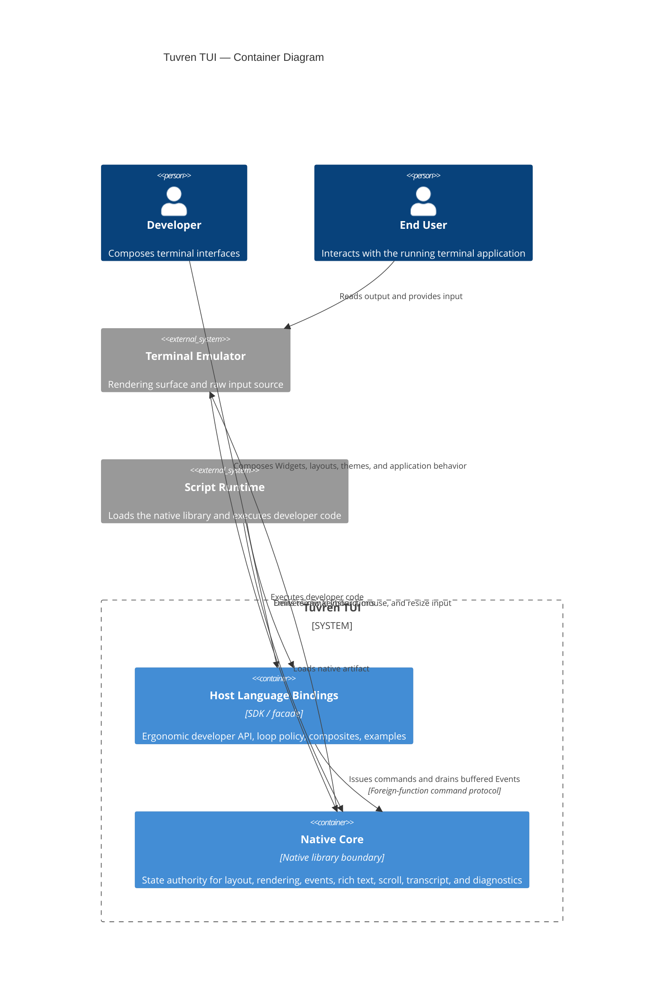

# Containers

## 0. Version

**v3.5.0** — corresponds to the latest entry in `.constitution/architecture/changelog.md`.

---

## 1. Logical Containers

### 1.1 Native Core

- **Logical Type:** Native library boundary
- **Responsibility:** Own all mutable Widget state, resolve layout, render to the terminal Surface, classify and buffer Events, manage scroll semantics, process rich text, and expose diagnostics for long-lived terminal workflows.
- **Inputs:** Host-issued commands, layout and style mutations, content updates, render requests, terminal input, terminal resize signals
- **Outputs:** Rendered terminal instructions, buffered Events, diagnostics snapshots and counters, explicit error results
- **Depends on:** Terminal Emulator, Script Runtime load boundary

### 1.2 Host Language Bindings

- **Logical Type:** Host SDK / developer facade
- **Responsibility:** Provide an ergonomic typed API for Developers, translate host-language intent into command calls, own loop policy, maintain developer-assigned ID maps, assemble higher-level composites and examples, and host framework services such as commands, keymaps, the package-first Effect surface, and pre-GA plugin slots without becoming a second source of UI truth.
- **Inputs:** Developer code, application state changes, optional replay streams, userland commands
- **Outputs:** Native command calls, host-facing Widget abstractions, developer-friendly diagnostics, example and composite surfaces
- **Depends on:** Native Core, Script Runtime

### 1.3 Terminal Emulator

- **Logical Type:** External rendering surface
- **Responsibility:** Present visual output, capture raw keyboard and mouse input, and expose terminal capability constraints.
- **Inputs:** Terminal instructions emitted by the Native Core
- **Outputs:** Raw input events, surface dimensions, capability characteristics
- **Depends on:** Operating system terminal primitives

### 1.4 Script Runtime

- **Logical Type:** External execution host
- **Responsibility:** Load the Native Core artifact, execute Developer code, and mediate the foreign-function boundary.
- **Inputs:** Developer program, package artifacts, runtime configuration
- **Outputs:** Process lifecycle, library loading, host-language execution
- **Depends on:** Native Core artifact, operating system process model

---

## 2. Native Core Bounded Contexts

| Bounded Context | Responsibility | Depends on |
| --- | --- | --- |
| **Tree** | Composition Tree CRUD, Handle allocation, parent-child relationships, subtree mutation, and dirty propagation | None |
| **Layout** | Constraint resolution, computed geometry, resize adaptation, and hit-test rectangles | Tree |
| **Theme** | Named style defaults, subtree bindings, and inherited theme resolution | Tree |
| **Style** | Explicit style application plus resolution against theme defaults | Tree, Theme |
| **Animation** | Time-based property transitions and animation-state progression | Tree, Style |
| **Text** | Content storage, parsing, syntax highlighting, viewport projection, and wrap resolution for substantial text surfaces | Style, Text Cache |
| **Text Cache** | Bounded reuse of parse, highlight, wrap, and viewport-projection artifacts | Text |
| **Transcript** | Ordered logical blocks, streaming patch semantics, collapse state, unread markers, and viewport anchor semantics, with block content storage and projection delegated to Text | Tree, Text, Scroll, Render |
| **Render** | Buffer generation, dirty diffing, clipping, and render-pass orchestration | Tree, Layout, Style, Text, Scroll |
| **Writer** | Terminal-intent compaction and efficient emission of cursor and style deltas | Render |
| **Event** | Input capture, classification, focus management, and buffered event delivery | Tree, Layout |
| **Scroll** | Scroll state, nested-scroll handoff rules, and clipping-relevant viewport data | Tree, Layout, Render |
| **Devtools** | Overlays, snapshots, traces, and diagnostic views for layout, focus, viewport, and render behavior | Tree, Layout, Render, Event |

---

## 3. Container Relationship Summary

- Host Language Bindings communicate with the Native Core through a flat command protocol and explicit event-drain model.
- The Native Core communicates with the Terminal Emulator through terminal output and raw input handling.
- The Script Runtime loads the Native Core and executes the Host Layer, but the Native Core never calls back into the Host Layer.

---

## 4. Container Diagram

