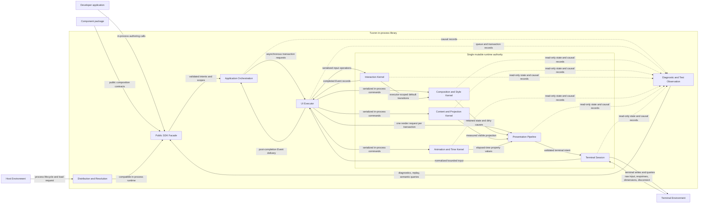

# Logical boundaries

## Version

**v4.0.7** — corresponds to the latest entry in `.constitution/architecture/changelog.md`.

## External actors and environments

### Application

- **Boundary kind:** External application domain
- **Logical type:** State and work owner
- **Responsibility:** Own durable business state, application services, external I/O, and decisions that outlive the UI projection.
- **Inputs:** End User intent, external results, Command outcomes, resident-range and eviction Events
- **Outputs:** View descriptions, controlled values, Commands, Data Source results, ordered UI transactions
- **Depends on:** Public SDK Facade

### Component package

- **Boundary kind:** External package
- **Logical type:** Reusable composition
- **Responsibility:** Package Components, Commands, Keymaps, helpers, and application services using only public SDK contracts.
- **Inputs:** Public Primitives, Component contracts, ThemeTokens, testing facade
- **Outputs:** Reusable public compositions
- **Depends on:** Public SDK Facade

### Host Environment

- **Boundary kind:** External execution environment
- **Logical type:** Process and scheduling host
- **Responsibility:** Run application work, load compatible artifacts, schedule concurrency, and deliver process interruption or termination.
- **Inputs:** Application package, release artifacts, process configuration
- **Outputs:** Process lifecycle, concurrent application execution, artifact-loading result
- **Depends on:** Distribution and Resolution, Public SDK Facade

### Terminal Environment

- **Boundary kind:** External device and intermediary chain
- **Logical type:** Interactive input and output environment
- **Responsibility:** Present cells and terminal behaviors, originate input, report dimensions and capabilities, enforce permissions, and preserve scrollback or modes.
- **Inputs:** Validated terminal intent and capability queries
- **Outputs:** Input, responses, dimensions, capability evidence, permission results, disconnects
- **Depends on:** Host Environment

## Tuvren boundaries

### Public SDK Facade

- **Boundary kind:** Library surface
- **Logical type:** Authoring facade
- **Responsibility:** Present the Effect UI SDK, Imperative SDK, Components, public types, errors, testing entrypoints, and managed or advanced lifecycle choices without exposing the private native boundary.
- **Inputs:** View descriptions, imperative operations, Theme and Style declarations, lifecycle requests, test actions
- **Outputs:** Validated application intents, typed outcomes, managed scopes, UI transaction requests
- **Depends on:** Application Orchestration, Distribution and Resolution

### Application Orchestration

- **Boundary kind:** Library module
- **Logical type:** Lifecycle and workflow coordinator
- **Responsibility:** Coordinate managed application lifetime, structured concurrent work, private Reactivity, view reconciliation, Commands, Keymaps, error boundaries, and application-facing Event delivery without owning native UI truth.
- **Inputs:** Public SDK intents, application state changes, normalized Events, Command invocations, external streams
- **Outputs:** UI transactions, Command outcomes, application Events, cleanup requests, causal correlation
- **Depends on:** UI Executor, Diagnostic and Test Observation

### UI Executor

- **Boundary kind:** In-process scheduling boundary
- **Logical type:** Single-writer command gateway
- **Responsibility:** Serialize runtime mutation, batch transactions, enforce queue limits, apply backpressure, coalesce eligible work, propagate cancellation, and request no more than one Render Pass per accepted transaction.
- **Inputs:** UI transaction requests, cancellation, lifecycle control, prioritized input work
- **Outputs:** Ordered runtime commands, transaction dispositions, Render Pass requests, queue diagnostics
- **Depends on:** Runtime Authority, Diagnostic and Test Observation

### Composition and Style Kernel

- **Boundary kind:** Native runtime module group
- **Logical type:** Retained UI state
- **Responsibility:** Own RuntimeNodes, tree identity and relationships, controlled-value projections, uncontrolled and ephemeral Component state, Layout Constraints, StyleSheets, Theme resolution, semantic metadata, focusable structure, and dirty propagation.
- **Inputs:** Ordered create, update, reorder, destroy, layout, style, Theme, and semantic commands
- **Outputs:** Retained Composition Tree, resolved style inputs, dirty causes, semantic state, structural queries
- **Depends on:** None inside the runtime authority

### Interaction Kernel

- **Boundary kind:** Native runtime module group
- **Logical type:** Input and interaction state machine
- **Responsibility:** Normalize input, hit-test, manage focus, Focus Scopes, modal behavior, pointer capture, drag-and-drop, selection and activation kernels, and deterministic Event ordering. The final interceptable Event lifecycle remains conditional on OD-02.
- **Inputs:** Terminal input, computed geometry, interaction commands, Event dispositions if OD-02 is ratified
- **Outputs:** Normalized Events, default state transitions, focus and pointer state, interaction dirty causes
- **Depends on:** Composition and Style Kernel, Presentation Pipeline, Terminal Session

### Content and Projection Kernel

- **Boundary kind:** Native runtime module group
- **Logical type:** Text and bounded resident state
- **Responsibility:** Own grapheme-correct Text Documents, StyledText projections, sanitized formatted text, Virtual Collection resident ranges, Transcript Blocks, viewport anchors, editing history, stale-result rejection, and bounded content caches.
- **Inputs:** Text edits, rich content, Data Source ranges, Transcript updates, selection and viewport commands
- **Outputs:** Measured and styled content, resident-range Events, eviction Events, reload demand, cursor and selection state
- **Depends on:** Composition and Style Kernel

### Animation and Time Kernel

- **Boundary kind:** Native runtime module
- **Logical type:** Deterministic time-based state
- **Responsibility:** Own elapsed-time animation progression, timelines, cancellation, replacement, completion, reduced-motion resolution, and manual-clock behavior.
- **Inputs:** Animation definitions, elapsed time, cancellation, reduced-motion policy
- **Outputs:** Applied property values, completion Events, animation dirty causes
- **Depends on:** Composition and Style Kernel

### Presentation Pipeline

- **Boundary kind:** Native runtime pipeline
- **Logical type:** Layout and rendering data plane
- **Responsibility:** Resolve layout, text measurement, clipping, responsive conditions, visible projections, cell generation, dirty-region diffing, adaptive presentation tiers, and compact terminal intent.
- **Inputs:** Retained UI state, content projections, animation values, Surface dimensions, Render Pass request
- **Outputs:** Updated Surface, terminal intent, performance counters, last known-good Surface
- **Depends on:** Composition and Style Kernel, Content and Projection Kernel, Animation and Time Kernel, Terminal Session

### Terminal Session

- **Boundary kind:** Native runtime adapter
- **Logical type:** Terminal control and trust boundary
- **Responsibility:** Own Screen Mode lifecycle, capability negotiation, raw input and response decoding, clipboard operations, external output policy, validated output, writes, suspend, resume, restoration, and disconnect handling.
- **Inputs:** Terminal intent, capability and clipboard requests, output-mode configuration, Terminal Environment input
- **Outputs:** Normalized input, capability state, typed clipboard outcomes, write completion or failure, lifecycle Events
- **Depends on:** Terminal Environment

### Diagnostic and Test Observation

- **Boundary kind:** Cross-cutting runtime and SDK module
- **Logical type:** Read-only observation plane
- **Responsibility:** Correlate the Diagnostic Graph, produce bounded Diagnostic Traces and Issues, provide Inspect and Timeline views, support replay, expose semantic and visual snapshots, provide headless Terminal Capability profiles, and verify cleanup.
- **Inputs:** Causal records from every Tuvren boundary, test actions, manual time, trace and snapshot requests
- **Outputs:** Diagnostics, bounded traces, Issues, replay input, semantic queries, snapshots, overhead reports
- **Depends on:** Every internal boundary through read-only observation seams

### Distribution and Resolution

- **Boundary kind:** Package and release boundary
- **Logical type:** Artifact selection and compatibility gate
- **Responsibility:** Deliver one public SDK with matching platform artifacts, select the supported artifact, reject mismatches before initialization, and provide actionable local diagnostics.
- **Inputs:** Host Environment identity, installed package set, release metadata, diagnostic request
- **Outputs:** Compatible loaded runtime or typed actionable failure, provenance and version evidence
- **Depends on:** Host Environment

## Ownership map

| State | Authority | Other boundaries may hold |
| :-- | :-- | :-- |
| Durable application domain state | Application | References and accepted snapshots |
| View description and Component composition intent | Application Orchestration | Immutable descriptions and stable author identities |
| Pending UI work | UI Executor | Bounded requests and cancellation state |
| RuntimeNode tree and ephemeral interaction state | Runtime Authority | Opaque references and copy-out diagnostics only |
| Controlled property source value | Application | Applied value in Runtime Authority |
| Uncontrolled property source value | Runtime Authority | Initial value and observable changes in Application |
| Transcript durable history in controlled mode | Application | Bounded Resident Projection in Content and Projection Kernel |
| Terminal modes and capability state | Terminal Session | Read-only capability snapshots |
| Diagnostic history | Diagnostic and Test Observation | Bounded redacted records only |

## Structure diagram

Every solid edge names an in-process communication category or the terminal I/O category. Dotted edges are read-only observation seams.
