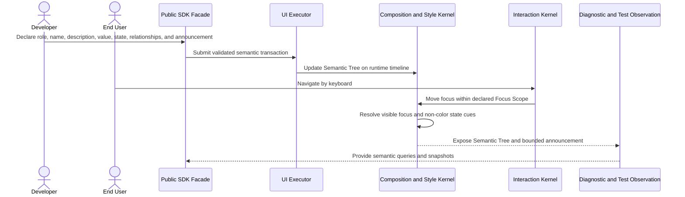

# Accessibility semantics flow

## Mapping

This flow satisfies PRD capabilities **P0-L01 through P0-L07**.

## Behavior view

## Failure path

Missing required semantics, invisible focus, color-only meaning, invalid relationships, or an unbounded announcement produces an Issue and fails Component conformance. Reduced motion changes presentation, not the resulting semantic state.
