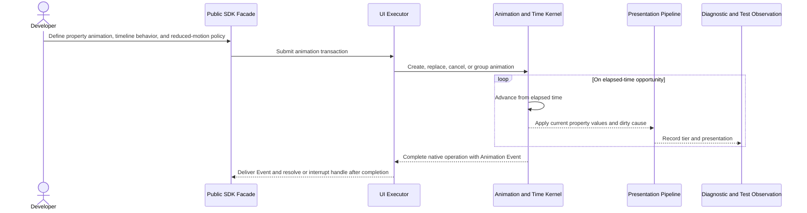

# Animation and time flow

## Mapping

This flow satisfies PRD capabilities **P0-M01 through P0-M06**.

## Behavior view

## Failure path

Invalid properties or timelines reject before activation. The native Time kernel never resolves an SDK handle directly; completion returns as an Animation Event through the executor-owned drain after native work ends. Under frame pressure, intermediate decorative presentations may be reduced, but elapsed duration, final state, completion, cancellation, and reduced-motion outcomes remain correct. Tests substitute deterministic manual time.
