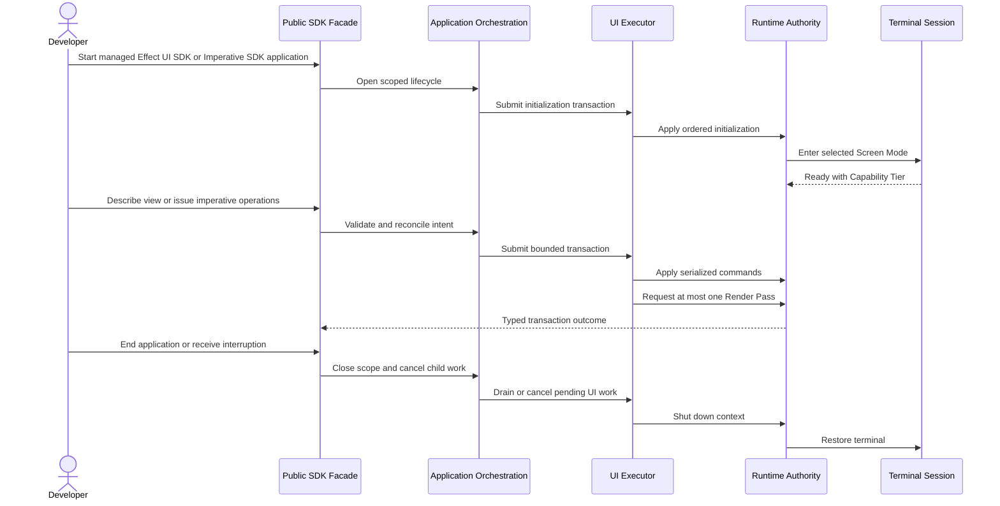

# Authoring and lifecycle flow

## Mapping

This flow satisfies PRD capabilities **P0-A01 through P0-A09**.

## Behavior view

## Failure path

Invalid intent rejects before enqueue. Saturation applies the declared backpressure or rejection policy without unbounded storage. Recoverable application, Command, Component, and validation failures preserve the active context and last known-good Surface where possible. An unrecovered root-lifecycle or runtime-invariant failure cancels scoped work, preserves bounded diagnostics, restores the terminal, and discards the inconsistent runtime context rather than reusing it.
