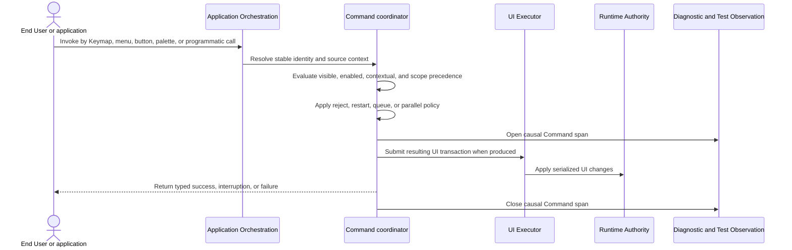

# Command and Keymap flow

## Mapping

This flow satisfies PRD capabilities **P0-H01 through P0-H08**.

## Behavior view

## Failure path

Missing, disabled, conflicting, or unavailable Commands return an explicit disposition. Restart cancels prior work before replacement; queue remains bounded; failure travels through the declared error boundary without duplicating action logic across invocation sources.
