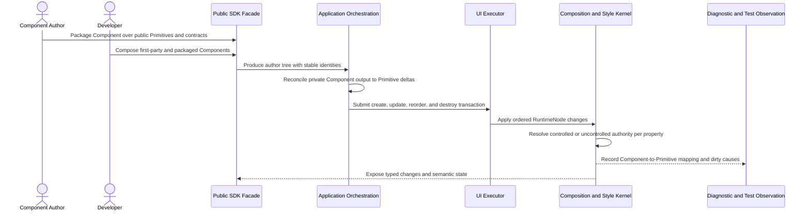

# Component composition flow

## Mapping

This flow satisfies PRD capabilities **P0-B01 through P0-B09**.

## Behavior view

## Failure path

Invalid composition, conflicting property authority, or unsupported Component state rejects with Component context before corrupting the retained tree. A failed package composition has no privileged recovery path and cannot register private runtime behavior.
