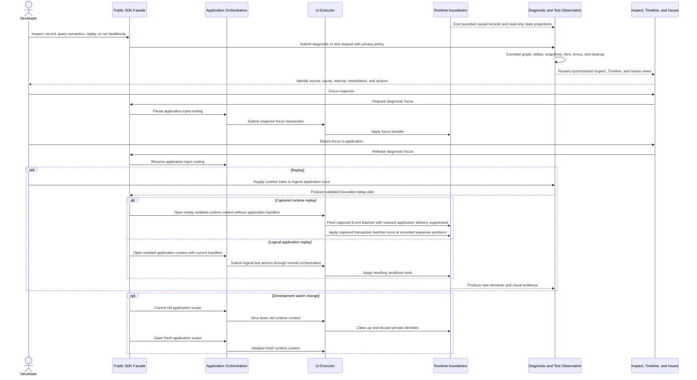

# Devtools, testing, and diagnostics flow

## Mapping

This flow satisfies PRD capabilities **P0-N01 through P0-N16**.

## Behavior view

## Failure path

Diagnostic overflow records a wrap marker. Unattributed late work becomes an explicit tooling defect. Malformed or incompatible traces reject before an isolated replay context starts. Runtime replay never executes current application handlers: captured Events drive only native interaction/default behavior, outward application delivery is suppressed, and captured application transactions are applied exactly once. Logical application replay intentionally executes current handlers and does not also inject captured transactions. If focus transfer fails, application input remains paused until focus ownership is known or the supervisor restores the session. If watch cleanup fails, the old context is discarded and no private identity crosses into the replacement. If the inspector cannot start, the supervisor restores the terminal and emits a redacted report outside the failed context.
