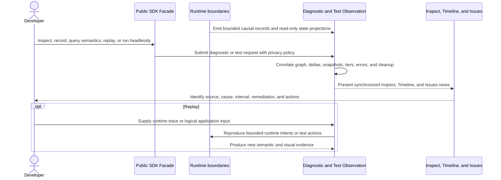

# Devtools, testing, and diagnostics flow

## Mapping

This flow satisfies PRD capabilities **P0-N01 through P0-N16**.

## Behavior view

## Failure path

Diagnostic overflow records a wrap marker. Unattributed late work becomes an explicit tooling defect. Malformed or incompatible traces reject safely. If the inspector cannot start, the supervisor restores the terminal and emits a redacted report outside the failed context.
