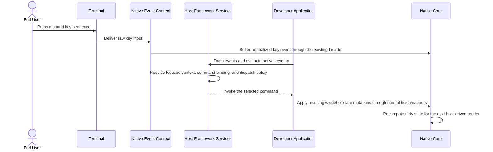

# Flow: Command Dispatch from Keymap Resolution

## 1. Mapping

- **PRD Capability:** Epic 11 — Commands & Keymap Foundations
- **Status:** Planned future flow for Epic R after the shipped productization and adoption waves; not shipped Brownfield runtime behavior.

---

## 2. Focus-Awareness Note

Epic R must obtain focused-context data from the Native Core through drained event payloads or an explicit query path; host-side framework services must not invent shadow focus state.

---

## 3. Sequence Diagram

