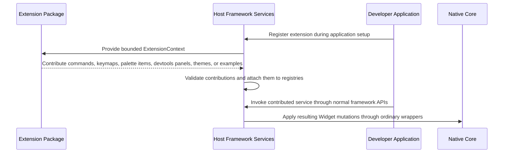

# Flow: Extension Contribution Registration

## 1. Mapping

- **PRD Capability:** Epic 13 — Extension Slots and Framework Contributions
- **Status:** Planned future flow for Epic T after commands/keymaps and Effect stabilize; not shipped Brownfield runtime behavior.

---

## 2. Authority Note

Extensions may contribute host-layer services and UI composites, but all Widget mutation still flows through ordinary Host-to-Core commands.

---

## 3. Sequence Diagram

