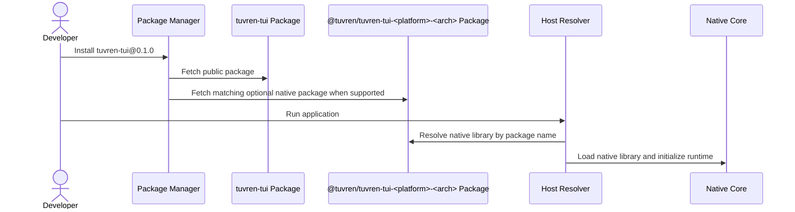

# Flow: First Public Package Install

## 1. Mapping

- **PRD Capability:** Epic 10 — Productized Installation & Release Trust; Epic 14 — Expert-Level SDK Developer Experience
- **Status:** Planned future flow for Epic V after SDK productization; not shipped Brownfield npm behavior.

---

## 2. Sequence Diagram

