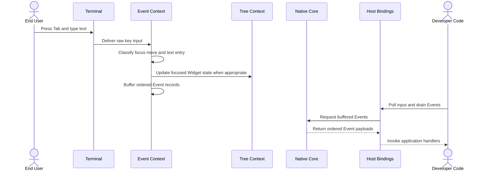

# Flow: Keyboard Input and Focus Traversal

## 1. Mapping

- **PRD Capability:** Epic 4 — Input & Focus

---

## 2. Sequence Diagram

```mermaid
sequenceDiagram
    actor EU as End User
    participant Term as Terminal
    participant Event as Event Context
    participant Tree as Tree Context
    participant Core as Native Core
    participant Host as Host Bindings
    actor Dev as Developer Code

    EU->>Term: Press Tab and type text
    Term->>Event: Deliver raw key input
    Event->>Event: Classify focus move and text entry
    Event->>Tree: Update focused Widget state when appropriate
    Event->>Event: Buffer ordered Event records
    Dev->>Host: Poll input and drain Events
    Host->>Core: Request buffered Events
    Core-->>Host: Return ordered Event payloads
    Host-->>Dev: Invoke application handlers
```
