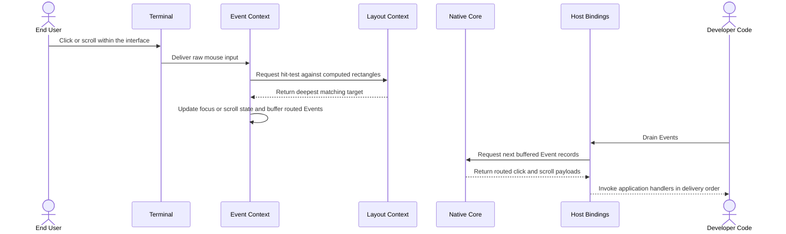

# Flow: Mouse Hit-Testing and Routed Interaction

## 1. Mapping

- **PRD Capability:** Epic 4 — Input & Focus; Epic 5 — Scrollable Regions

---

## 2. Sequence Diagram

```mermaid
sequenceDiagram
    actor EU as End User
    participant Term as Terminal
    participant Event as Event Context
    participant Layout as Layout Context
    participant Core as Native Core
    participant Host as Host Bindings
    actor Dev as Developer Code

    EU->>Term: Click or scroll within the interface
    Term->>Event: Deliver raw mouse input
    Event->>Layout: Request hit-test against computed rectangles
    Layout-->>Event: Return deepest matching target
    Event->>Event: Update focus or scroll state and buffer routed Events
    Dev->>Host: Drain Events
    Host->>Core: Request next buffered Event records
    Core-->>Host: Return routed click and scroll payloads
    Host-->>Dev: Invoke application handlers in delivery order
```
