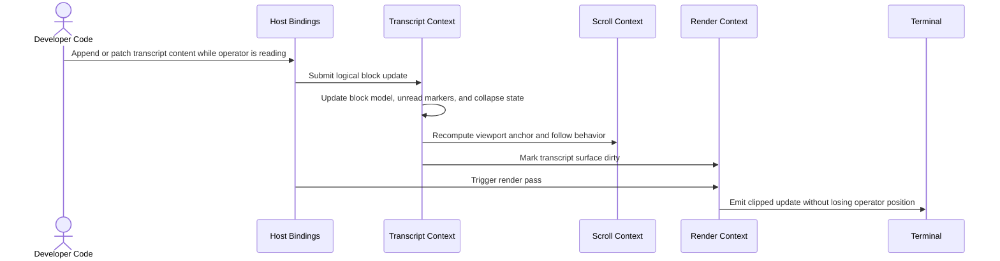

# Flow: Streaming Transcript Update with Stable Viewport

## 1. Mapping

- **PRD Capability:** Epic 5 — Scrollable Regions; current product emphasis on long-lived developer and agent workflows

---

## 2. Sequence Diagram

