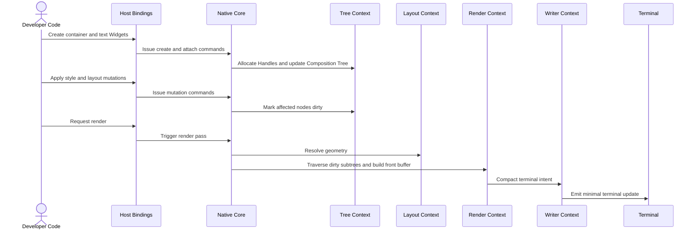

# Flow: Widget Composition and First Render

## 1. Mapping

- **PRD Capability:** Epic 1 — Widget Composition; Epic 2 — Spatial Layout; Epic 3 — Visual Styling

---

## 2. Sequence Diagram

```mermaid
sequenceDiagram
    actor Dev as Developer Code
    participant Host as Host Bindings
    participant Core as Native Core
    participant Tree as Tree Context
    participant Layout as Layout Context
    participant Render as Render Context
    participant Writer as Writer Context
    participant Term as Terminal

    Dev->>Host: Create container and text Widgets
    Host->>Core: Issue create and attach commands
    Core->>Tree: Allocate Handles and update Composition Tree
    Dev->>Host: Apply style and layout mutations
    Host->>Core: Issue mutation commands
    Core->>Tree: Mark affected nodes dirty
    Dev->>Host: Request render
    Host->>Core: Trigger render pass
    Core->>Layout: Resolve geometry
    Core->>Render: Traverse dirty subtrees and build front buffer
    Render->>Writer: Compact terminal intent
    Writer->>Term: Emit minimal terminal update
```
