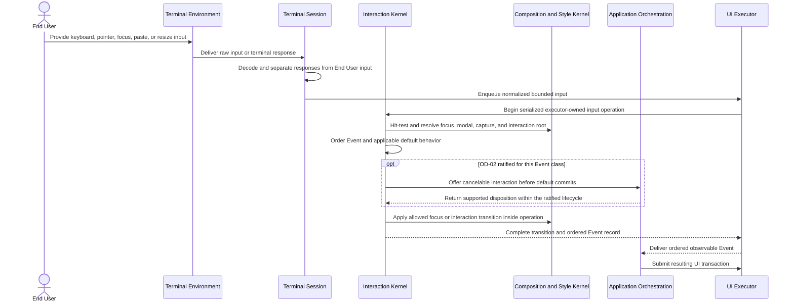

# Input, Event, focus, and direct-manipulation flow

## Mapping

This flow satisfies PRD capabilities **P0-G01 through P0-G08**. P0-G03 and P0-G04 remain contingent on OD-02.

## Behavior view

## Failure path

Malformed input, missing target, handler failure, reentrancy, shutdown, or queue pressure cannot leave a pending Event unbounded or apply a transition twice. Input polling and every Interaction or Composition transition occur only in the serialized operation initiated by the UI Executor; Terminal Session decoding never mutates UI state directly. Until OD-02 is ratified, downstream design must not assume capture, bubble, disposition timing, or a host round trip.
