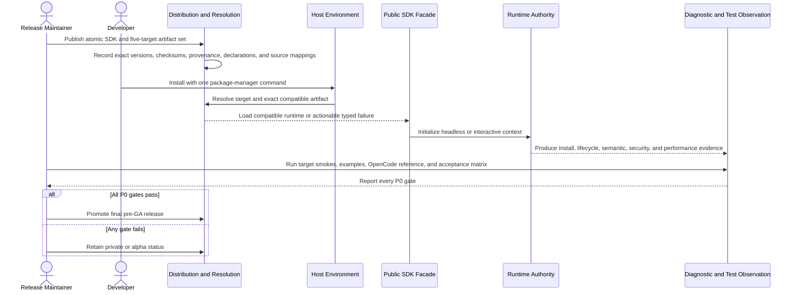

# Installation, distribution, safety, and release flow

## Mapping

This flow satisfies PRD capabilities **P0-O01 through P0-O19**.

## Behavior view

## Failure path

Unsupported targets, missing artifacts, version mismatch, load failure, unsafe content, failed cleanup, absent example evidence, or an unmet absolute or ratified comparative gate blocks final release. Diagnostics identify the failed dimension without exposing private boundary statuses.
