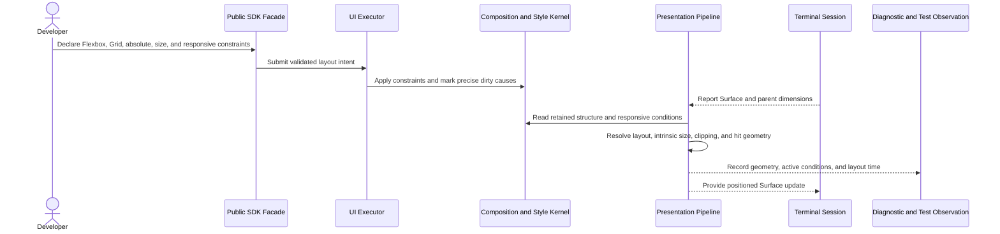

# Layout and responsive behavior flow

## Mapping

This flow satisfies PRD capabilities **P0-C01 through P0-C09**.

## Behavior view

## Failure path

Unsupported or contradictory constraints fail with a source-linked Issue. If no responsive condition fits, the declared clip, scroll, or minimum-size behavior applies; the pipeline never invents undefined geometry or browser document-flow behavior.
