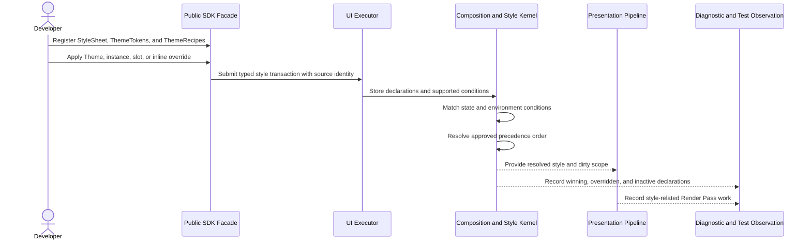

# Styling and Theme flow

## Mapping

This flow satisfies PRD capabilities **P0-D01 through P0-D09**.

## Behavior view

## Failure path

Unknown properties, conditions, or private slots reject at the SDK or runtime validation seam. A condition mismatch selects the next valid declaration; it does not invoke application code or fall back to a general selector cascade.
