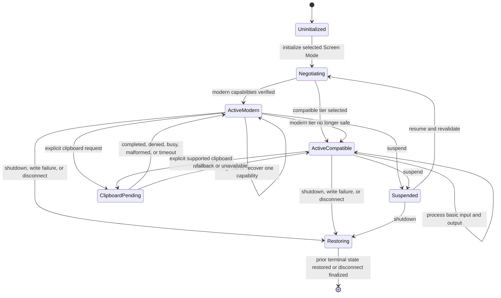

# Terminal, Screen Mode, and clipboard flow

## Mapping

This flow satisfies PRD capabilities **P0-K01 through P0-K16**.

## Behavior view

## Failure path

Negotiation ambiguity selects the compatible tier or degrades one capability. Clipboard requests are explicit, bounded, correlated, and typed; response bytes never become keyboard Events. A write failure or disconnect ends the active context and attempts deterministic restoration rather than continuing with uncertain terminal state.
