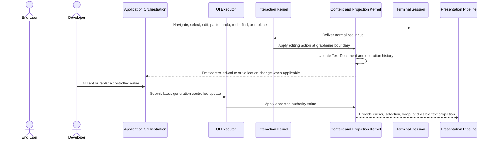

# Text editing flow

## Mapping

This flow satisfies PRD capabilities **P0-F01 through P0-F10**.

## Behavior view

## Failure path

Read-only, disabled, maximum-length, validation, secure-entry, or stale-generation rules reject or contain the edit according to the declared mode. Invalid clipboard input is bounded and sanitized before it can alter the Text Document.
