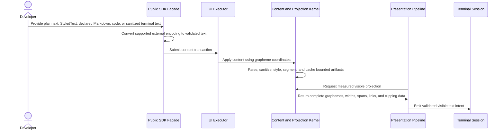

# Text and rich-content flow

## Mapping

This flow satisfies PRD capabilities **P0-E01 through P0-E11**.

## Behavior view

## Failure path

Malformed encoding, forbidden terminal control, invalid links, or out-of-range grapheme positions reject with typed content context. Sanitization may retain allowlisted style and validated hyperlinks but never cursor, title, clipboard, or other terminal-control operations.
