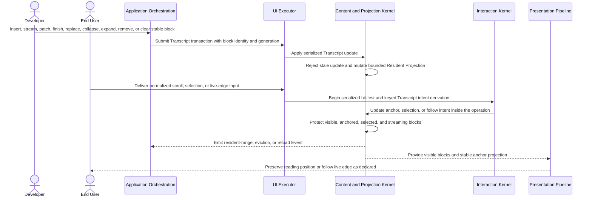

# Transcript and streaming-data flow

## Mapping

This flow satisfies PRD capabilities **P0-J01 through P0-J07**.

## Behavior view

## Failure path

A stale update, missing durable range, or memory-pressure eviction cannot silently delete application-controlled history or displace a protected anchor. Interaction never mutates Transcript state outside an executor-owned operation. The local mode applies its declared bound; controlled mode requests reload from the application.
