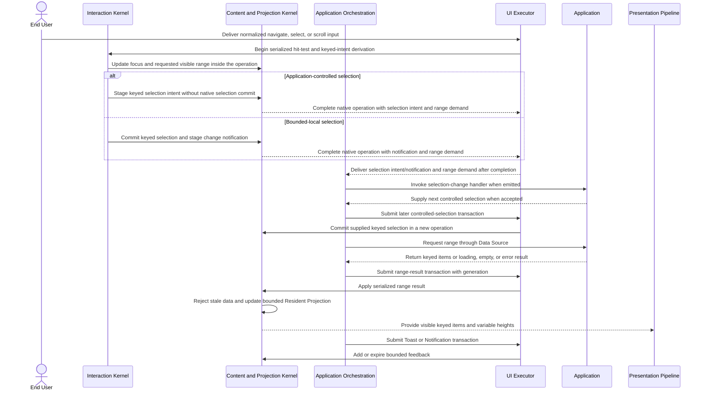

# Virtual Collection and transient-feedback flow

## Mapping

This flow satisfies PRD capabilities **P0-I01 through P0-I08**.

## Behavior view

## Failure path

Cancelled or stale range results do not alter the Resident Projection. Interaction and Content transitions occur only inside executor-owned operations. Controlled selection never commits from interaction, a controller, or a mutation Stream; those paths return intent to the executor, complete native work, and only then notify application orchestration. A controlling prop change enters a later transaction. Bounded-local mode commits, completes, and then notifies. No native kernel calls application code or reenters mutation. Missing stable keys, duplicate keys, overflow, and invalid variable heights produce typed Issues. Loading, empty, and error states remain navigable and semantic rather than collapsing into absent content.
