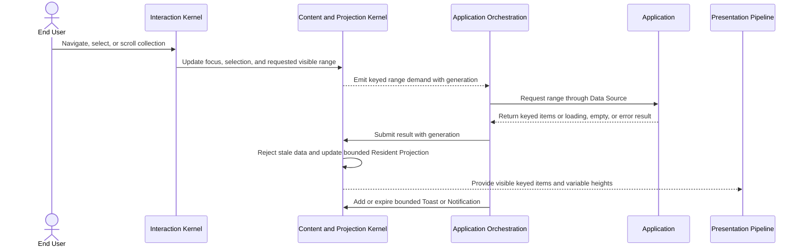

# Virtual Collection and transient-feedback flow

## Mapping

This flow satisfies PRD capabilities **P0-I01 through P0-I08**.

## Behavior view

## Failure path

Cancelled or stale range results do not alter the Resident Projection. Missing stable keys, duplicate keys, overflow, and invalid variable heights produce typed Issues. Loading, empty, and error states remain navigable and semantic rather than collapsing into absent content.
