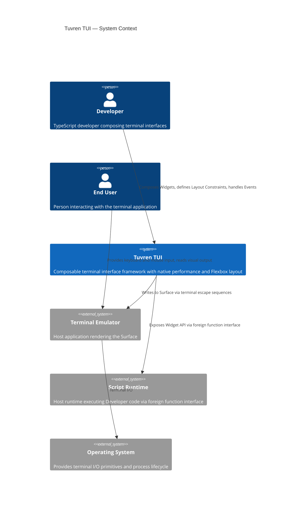
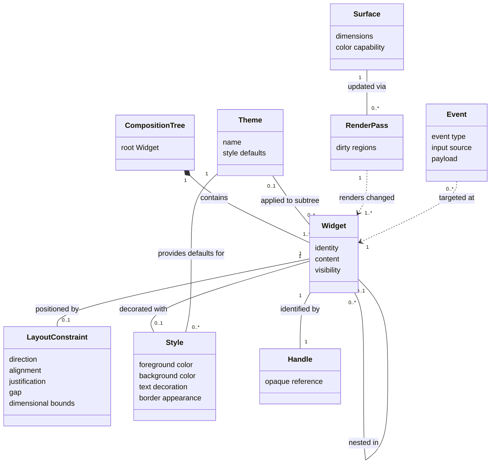

# Domain Model

## 1. Conceptual Diagrams

### 1.1 System Context

```mermaid
C4Context
    title Tuvren TUI — System Context

    Person(developer, "Developer", "TypeScript developer composing terminal interfaces")
    Person(enduser, "End User", "Person interacting with the terminal application")

    System(tuvren, "Tuvren TUI", "Composable terminal interface framework with native performance and Flexbox layout")

    System_Ext(terminal, "Terminal Emulator", "Host application rendering the Surface")
    System_Ext(runtime, "Script Runtime", "Host runtime executing Developer code via foreign function interface")
    System_Ext(os, "Operating System", "Provides terminal I/O primitives and process lifecycle")

    Rel(developer, tuvren, "Composes Widgets, defines Layout Constraints, handles Events")
    Rel(enduser, terminal, "Provides keyboard and mouse input, reads visual output")
    Rel(tuvren, terminal, "Writes to Surface via terminal escape sequences")
    Rel(tuvren, runtime, "Exposes Widget API via foreign function interface")
    Rel(terminal, os, "Terminal I/O")
```

### 1.2 Domain Model

```mermaid
classDiagram
    class Widget {
        identity
        content
        visibility
    }

    class CompositionTree {
        root Widget
    }

    class LayoutConstraint {
        direction
        alignment
        justification
        gap
        dimensional bounds
    }

    class Style {
        foreground color
        background color
        text decoration
        border appearance
    }

    class Theme {
        name
        style defaults
    }

    class Handle {
        opaque reference
    }

    class Event {
        event type
        input source
        payload
    }

    class Surface {
        dimensions
        color capability
    }

    class RenderPass {
        dirty regions
    }

    CompositionTree "1" *-- "1..*" Widget : contains
    Widget "1" -- "1" Handle : identified by
    Widget "1" -- "0..1" LayoutConstraint : positioned by
    Widget "1" -- "0..1" Style : decorated with
    Widget "0..*" -- "0..1" Widget : nested in
    Theme "1" -- "0..*" Style : provides defaults for
    Theme "0..1" -- "0..*" Widget : applied to subtree
    Surface "1" -- "0..*" RenderPass : updated via
    RenderPass "1" ..> "1..*" Widget : renders changed
    Event "0..*" ..> "1" Widget : targeted at
```
