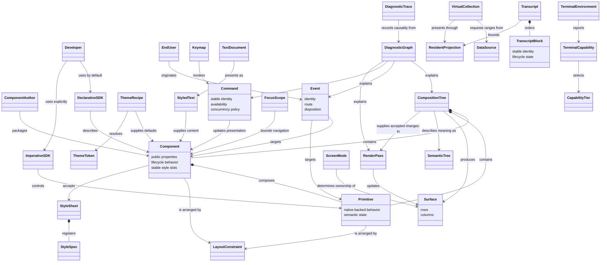

# Domain model

This model describes the product concepts Developers and End Users interact with. It does not prescribe implementation containers, processes, protocols, or deployment topology.

## Ownership invariants

- A Component is the public reusable authoring abstraction; a Primitive is the public low-level building block beneath it.
- The internal RuntimeNode concept does not participate in the public problem-space model.
- Each controlled or uncontrolled property has one authority at a time.
- An application's durable data remains distinct from its bounded Resident Projection.
- A Render Pass applies accepted changes to a Surface; it does not create a second source of application truth.
- The Semantic Tree expresses meaning independently of the cells presented on a Surface.
- Terminal Capabilities determine behavior through detection, and a Capability Tier groups the resulting guarantees.
