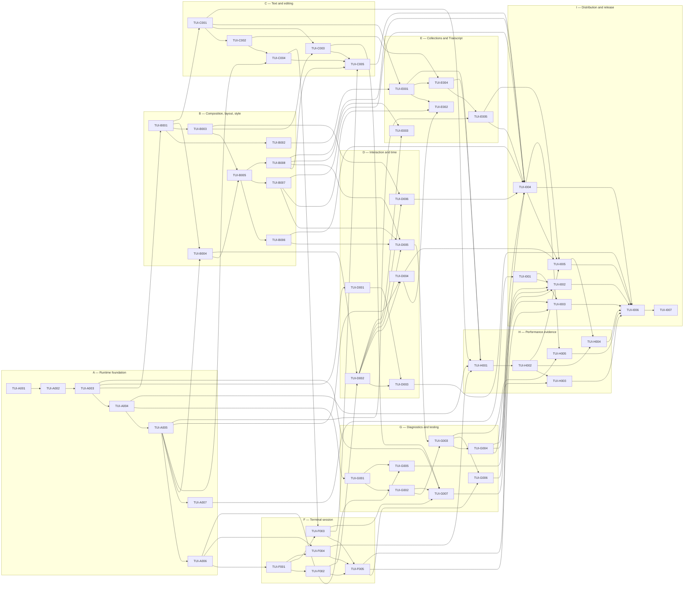

# Critical path

## Version

**v10.0.0** — corresponds to the latest entry in `.constitution/tasks/changelog.md`.

## Active backlog summary

- **Total active story points:** 350 across 55 tickets. Completed and deferred work contributes 0.
  - Epic A — Runtime foundation and public SDK boundary: 44
  - Epic B — Composition, layout, styling, and Components: 61
  - Epic C — Text, rich content, and editing: 34
  - Epic D — Interaction, Commands, accessibility, and animation: 36
  - Epic E — Virtual Collections, transient feedback, and Transcript: 32
  - Epic F — Modern terminal session and Screen Modes: 34
  - Epic G — Diagnostics, testing, devtools, and recovery: 42
  - Epic H — Performance and adoption evidence: 22
  - Epic I — Distribution, examples, OpenCode evidence, and atomic release: 45
- **Critical path (111 points):**
  1. `TUI-A001`
  2. `TUI-A002`
  3. `TUI-A003`
  4. `TUI-A004`
  5. `TUI-A005`
  6. `TUI-A006`
  7. `TUI-F001`
  8. `TUI-F002`
  9. `TUI-D002`
  10. `TUI-D005`
  11. `TUI-G003`
  12. `TUI-G004`
  13. `TUI-I004`
  14. `TUI-I005`
  15. `TUI-H004`
  16. `TUI-I006`
  17. `TUI-I007`

The path is the longest effort-weighted chain under the declared dependencies. Tickets whose prerequisites are satisfied may execute in parallel; the one-work-item execution workflow still reviews and integrates their milestone commits independently.

## Planning assumptions

- This is a Brownfield replacement plan for the realigned PRD v3.0.0, Architecture v4.0.0, and TechSpec v9.0.0. It supersedes the prior Plugin-era active Epics U–Z instead of preserving incompatible work as active.
- `.constitution/tasks/completed/` remains historical continuity and was listed, not read or modified. Superseded active files are removed rather than moved into completed history because they were plans, not delivered scope.
- The current source remains useful Brownfield evidence, but target paths and commands follow Stage 3. TUI-A001 owns the migration to the root Bun workspace and repairs the known strict TypeScript baseline.
- OD-02 is represented only by `TUI-D001` and the gated `TUI-D003`. A No-Go requires Stage 1–3 Evolution and Stage 4 replanning; it does not authorize an improvised interaction contract.
- OD-01 is represented only by `TUI-H004`. The 120/90/60 absolute tiers remain binding before and after it; comparative margins become gates only through Stage 1–3 Evolution.
- `tuvren-tui@0.1.0` is the first public release. The OpenCode client is required release evidence through an application adapter and replay fixture, never a core integration contract.
- Story points use the required Fibonacci values and describe roughly one to three focused solo-dev days per ticket. An 8-point ticket is a concentrated high-complexity slice, not an unbounded epic.

## Phasing strategy

### Active `0.1.0` scope

1. Establish the pinned build, exact contracts, explicit contexts, UI executor, typed transaction ABI, and public SDK split.
2. Build reusable native composition, layout, style, text, interaction, Collection, Transcript, terminal, animation, and diagnostic kernels behind thin SDK surfaces.
3. Complete the first-party Component catalog, accessibility semantics, testing/devtools, recovery, security, and bounded-resource behavior.
4. Prove absolute performance and adoption constraints, close OD-01/OD-02 through their required Evolution paths, package all five targets, and exercise representative examples including OpenCode.
5. Publish only after the atomic release candidate satisfies every P0 gate.

### Deferred scope

- All PRD P1 `0.2.0` capabilities: bidirectional text, multiple cursors, folding, language intelligence, public cell Surface, images, routing, form orchestration, springs/keyframes, and assistive-technology bridges.
- All P2 RuntimeExtension, Plugin ecosystem, remote devtools, additional host/target, and remote-session commitments.
- Musl/Alpine, Node compatibility, public FFI, state-preserving reload, background native authority, arbitrary terminal controls, integrated Select search, and competitor-relative hard cuts not ratified through OD-01.

## Build order diagram

Each arrow means “depends on.”

