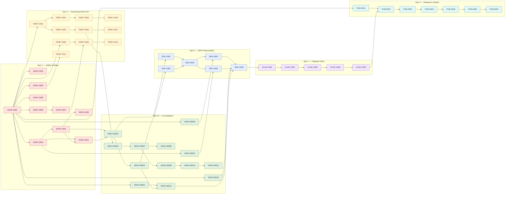

# Critical Path

## 0. Version

**v9.0.0** — corresponds to the latest entry in `.constitution/tasks/changelog.md`.

---

## 1. Active Backlog Summary

- **Total Active Story Points:** 177
  - Epic U — Safety, Correctness & Gates: 26
  - Epic V — Streaming-Scale Performance: 37
  - Epic W — Architecture Consolidation & Tech Debt: 45
  - Epic X — SDK Productization / Expert-Level DX: 24
  - Epic Y — OpenCode Flagship Client: 19
  - Epic Z — Release Readiness & First Public npm Publish: 26
- **Critical Path:**
  1. `SAFE-U001` → 2. `SAFE-U002` → 3. `SAFE-U003` → 4. `SAFE-U004` → 5. `SAFE-U005` → 6. `SAFE-U006` → 7. `SAFE-U007` → 8. `SAFE-U008` → 9. `SAFE-U009` → 10. `SAFE-U010` → 11. `PERF-V001` → 12. `PERF-V002` → 13. `PERF-V003` → 14. `PERF-V004` → 15. `PERF-V005` → 16. `PERF-V006` → 17. `PERF-V007` → 18. `PERF-V008` → 19. `PERF-V009` → 20. `PERF-V010` → 21. `PERF-V011` → 22. `ARCH-W001` → 23. `ARCH-W002` → 24. `ARCH-W003` → 25. `ARCH-W004` → 26. `ARCH-W005` → 27. `ARCH-W006` → 28. `ARCH-W007` → 29. `ARCH-W008` → 30. `ARCH-W009` → 31. `ARCH-W010` → 32. `ARCH-W011` → 33. `ARCH-W012` → 34. `ARCH-W013` → 35. `SDK-X001` → 36. `SDK-X002` → 37. `SDK-X003` → 38. `SDK-X004` → 39. `SDK-X005` → 40. `SDK-X006` → 41. `FLAG-Y001` → 42. `FLAG-Y002` → 43. `FLAG-Y003` → 44. `FLAG-Y004` → 45. `FLAG-Y005` → 46. `PUB-Z001` → 47. `PUB-Z002` → 48. `PUB-Z003` → 49. `PUB-Z004` → 50. `PUB-Z005` → 51. `PUB-Z006` → 52. `PUB-Z007`

The numbered list is a valid full linearization; tickets whose declared
dependencies are already satisfied may run in parallel with it (e.g.
`PUB-Z001` any time after `SAFE-U001`, `PERF-V008` alongside the Transcript
track).

---

## 2. Planning Assumptions

- The pre-GA deep audit (`.constitution/reports/audit-2026-07-07-161112-pre-ga-deep-audit.md`, commit `8ec41b1`) is the gap inventory for this wave. It supersedes the former SDK-U001 and PUB-V001 audit spikes.
- **Publishing is deliberately deferred to the end of the wave.** `tuvren-tui@0.1.0` ships only after hardening (U), streaming-scale performance (V), consolidation (W), SDK productization (X), and the flagship proof (Y). There is no calendar urgency; correctness ordering wins over publish speed.
- Contract-level changes (dirty-gated Render Pass, Transcript accounting/retention, dual text authority retirement, layout engine upgrade, OpenCode integration) are established through Spike tickets whose recommendations a Stage 3 TechSpec pass adopts as ADRs before the dependent implementation tickets begin.
- Epic letters U and V are reused in place with new scope; the former Epic U (SDK productization) scope now lives in Epic X, and the former Epic V (first public npm) scope now lives in Epic Z. Sequence position is preserved.
- Bun remains the only supported runtime. First public npm publish remains `0.1.0` pre-GA; breaking changes stay allowed before public `v1.0 GA`.
- The canonical remote is `Tuvren/tuvren-tui`; the product story is general-purpose framework first with agentic/transcript-heavy products as the flagship proof workload — Epic Y makes that proof concrete.

---

## 3. Phasing Strategy

### Current Active Scope

- **Epic U — Safety, Correctness & Gates:** Gate every real test suite in CI, add a single-command verification baseline, and fix the audit's safety cluster: control-sequence sanitization, poison-lock recovery with guaranteed terminal restore, swallowed event errors, unbounded event buffer, JSX mount handle leaks, fragment ordering, swallowed native Results, width divergence, and the small-correctness batch.
- **Epic V — Streaming-Scale Performance:** Land scaling benchmarks first, then remove the flagship-workload ceilings: incremental Transcript accounting, bounded retention, dirty-gated Render Passes (restoring the PRD's changed-regions-only promise), clone elimination, encoder hoisting, and per-index delta application for collection Widgets.
- **Epic W — Architecture Consolidation & Tech Debt:** One run-loop core with thin adapters and a wake seam, deletion of the retired background-render experiment, phased dual-text-authority retirement, examples rebased onto the public API, end-to-end Plugin palette wiring with registry subscription, FFI diagnostics at both ends, expanded goldens, behavioral substrate gates, the layout-engine major upgrade behind that armor, and the DX/docs batches.
- **Epic X — SDK Productization / Expert-Level DX:** The ADR-T47 mandate on the consolidated base: handle-safe event/focus ergonomics, wrapper-gap closure (including the four orphaned native bindings), lifecycle ergonomics, reworked per-style examples, diagnostics polish, and the formal productization gate.
- **Epic Y — OpenCode Flagship Client:** A real agent console in `examples/opencode-client/` — SplitPane + streaming Transcript shell, live session integration with interrupts, Commands/Keymaps/palette/Plugin wiring, and replay-fixture CI coverage — as the end-to-end proof of Epics U–X and the launch centerpiece.
- **Epic Z — Release Readiness & First Public npm Publish:** Supply-chain hardening (committed lockfile, dependency audit gate, pinned actions), publishable package payloads, the npm publish workflow, packed/registry resolver smoke, the cross-platform release-candidate dry-run, the `0.1.0` publish, and the post-publish feedback loop.

### Future / Deferred Scope

- No Theme-slot contribution payloads (shape change plus native Handle disposal design) in the active wave; slots stay pre-GA per ADR-T46.
- No devtools panel host for Plugin contributions; the devtools slot remains catalog metadata.
- No native run-loop waker; the host-side wake seam in ARCH-W001 bounds latency, and a native waker is only revisited if that bound proves insufficient.
- No bulk packed-buffer batch FFI; the delta layer (PERF-V009/V010) removes its motivation.
- No Node runtime portability, no React or Solid parity, no musl/Alpine support, no generic widget-breadth wave, and no default background-render promotion — all per the standing `.constitution/prd/out-of-scope/` decisions.
- Post-v0.1 roadmap planning is a future Stage 4 pass fed by the PUB-Z007 feedback loop; no v1.0 compatibility guarantees are made in this wave.

---

## 4. Build Order Diagram

