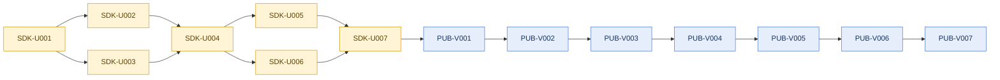

# Critical Path

## 0. Version

**v8.2.0** — corresponds to the latest entry in `.constitution/tasks/changelog.md`.

---

## 1. Active Backlog Summary

- **Total Active Story Points:** 56 (Epic T shipped)
- **Critical Path:** `SDK-U001 -> SDK-U002 -> SDK-U003 -> SDK-U004 -> SDK-U005 -> SDK-U006 -> SDK-U007 -> PUB-V001 -> PUB-V002 -> PUB-V003 -> PUB-V004 -> PUB-V005 -> PUB-V006 -> PUB-V007`

---

## 2. Planning Assumptions

- Epic M, Epic N, Epic O, Epic P, and Epic Q are all shipped. The Brownfield source now includes the native text substrate, transcript and split-pane semantics, devtools, terminal-capability hardening, the full Tuvren hard-cut rename, and the general-purpose framework onboarding and migration story.
- The GitHub repository move is complete; the canonical remote is `Tuvren/tuvren-tui`.
- The product story is **general-purpose framework first**, with agentic and transcript-heavy products as the flagship showcase and harshest proof workload.
- Bun remains the only supported runtime in the active contract. Node portability is deferred.
- First public npm publish is planned as `0.1.0` pre-GA, not `v1.0`; breaking changes remain allowed before public `v1.0 GA`.
- React and Solid parity are not roadmap goals in this planning wave.

---

## 3. Phasing Strategy

### Current Active Scope

- **Epic U — SDK Productization / Expert-Level DX:** Productize all public SDK surfaces before npm publish: imperative, JSX, Effect, plugins, composites, examples, and devtools.
- **Epic V — First Public npm Publish and Feedback Loop:** Publish `tuvren-tui@0.1.0` plus auxiliary native packages and establish post-publish feedback triage.

### Future / Deferred Scope

- No Node runtime portability in the active wave.
- No React or Solid parity work; the declarative strategy is `Effect`, not framework-adapter breadth.
- No `v1.0` compatibility guarantee in Epics R-V; plugin slots and Effect integration remain pre-GA.
- No generic widget-breadth wave as a substitute for productization and framework ergonomics.
- No default background-render promotion while synchronous semantics remain the canonical contract.
- No clipboard read support, Kitty graphics, sixel, inline image protocols, or advanced MIME clipboard work in the active wave.
- No public musl/Alpine support before a separate release-matrix decision.

---

## 4. Build Order Diagram

