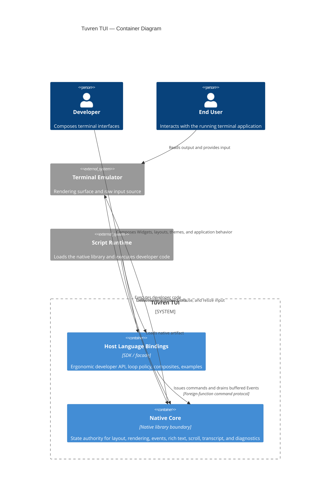
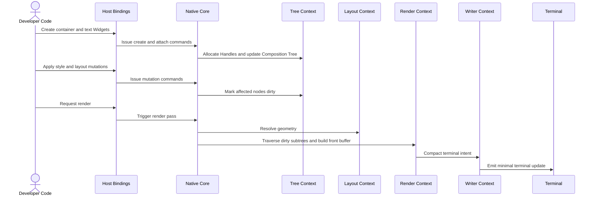
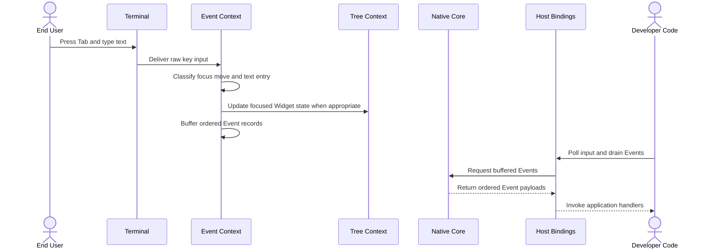
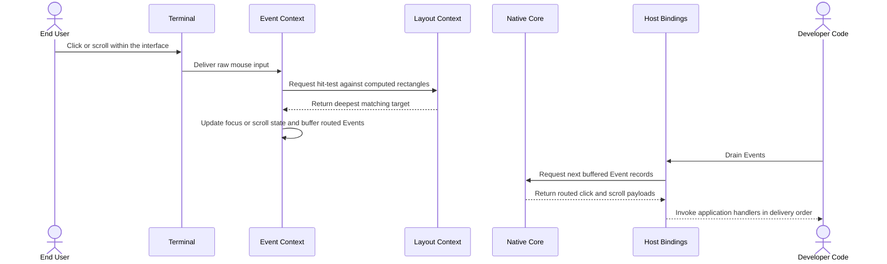
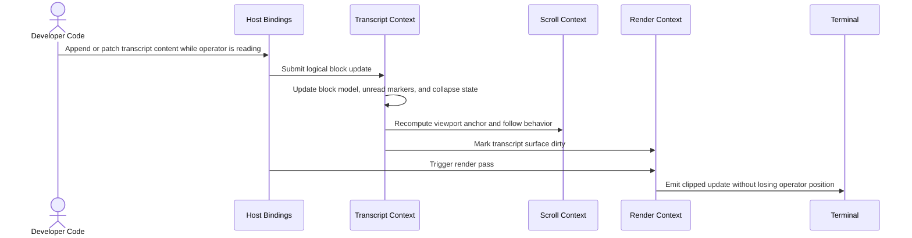
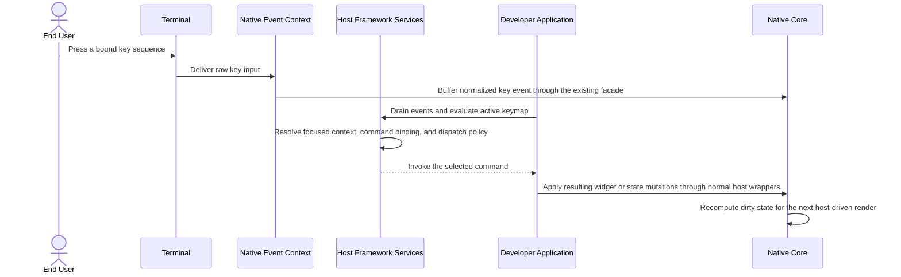
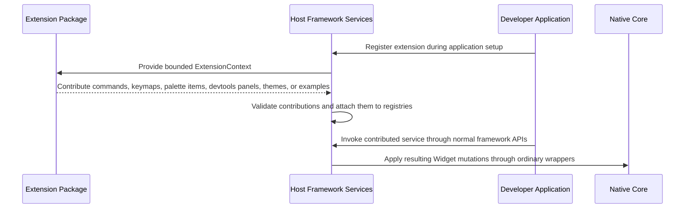
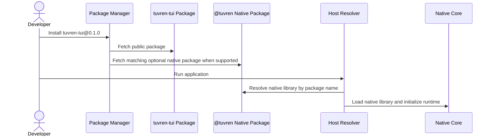

# Solution Architecture

## 0. Version History & Changelog
- v3.5.0 - Reframed Epic S at the architectural layer: `tuvren-tui/effect` is now the package-first Effect application surface over the same native runtime authority, with JSX authoring, package-owned commands/keybindings, testing helpers, and advanced escape hatches instead of an adapter-like orchestration stub.
- v3.4.0 - Extended the roadmap architecture through Epics R-V: commands/keymaps, Effect, pre-GA plugin slots, SDK productization, and first public npm release as `0.1.0`.
- v3.3.0 - Rebalanced the architecture around a general-purpose Tuvren framework posture, elevated productization to an architectural concern, and added host-side framework-service direction with explicit Brownfield transition notes.
- v3.2.1 - Clarified the Text and Transcript bounded-context responsibilities so the substrate work ratified downstream is recognized as a deepening of existing logical contexts rather than a new container.
- ... [Older history truncated, refer to git logs]

## 1. Architectural Strategy & Archetype Alignment
- **Architectural Pattern:** Modular monolith with a cross-language facade.
- **Why this pattern fits the PRD:** Tuvren is a single-process framework rather than a networked product. The PRD asks for native performance, low memory use, and fast developer onboarding; a modular monolith avoids the operational premium of distributed systems while still preserving clean boundaries between the native performance engine and the host-facing API.
- **Core trade-offs accepted:** The architecture favors explicit host-driven control over hidden background orchestration, keeps all mutable UI state in one native authority, and accepts a tighter internal coupling inside the native core in exchange for lower latency and a smaller foreign-function surface.

### 1.1 Core Architectural Invariant
- **Invariant:** The Native Core is the performance engine; Host Language Bindings are the steering layer.
- **Meaning:** Layout computation, tree traversal, buffer diffing, text parsing, hit-testing, scroll semantics, and event classification remain in the Native Core. The Host Layer stays responsible for ergonomics, application loop policy, developer-assigned identifiers, and composition patterns built on top of the command protocol.

### 1.2 Architectural Rationale
- The cross-language split preserves one performance-critical authority while letting Developers work from a familiar host language API.
- The facade boundary prevents internal native module complexity from leaking into application code.
- The host-driven render and event loop model keeps state visibility and terminal lifecycle explicit, which matters for deterministic debugging and long-lived workflows.

### 1.3 Current Architectural Emphasis

| Emphasis | Choice | Why it matters |
| --- | --- | --- |
| **General-purpose framework posture** | Keep the architecture broad enough for general terminal application shapes instead of treating one showcase workload as the whole product definition. | The product story now targets a framework, not only a specialist library. |
| **Flagship demanding workloads** | Continue treating long-lived transcript, log, trace, and pane-heavy surfaces as the proving grounds that validate the broader framework design. | Agentic and operator-style products still justify the hardest architectural requirements. |
| **Anchor-aware viewports** | Prefer logical viewport anchors, unread markers, and nested-scroll handoff over raw row-offset management where streaming surfaces require it. | The general-purpose story must still survive demanding update churn in flagship workloads. |
| **Developer tooling as product work** | Treat overlays, snapshots, traces, and inspection surfaces as architecture-level concerns. | The framework must be inspectable before it can be dependable. |
| **Host-layer framework services** | Commands, keymaps, Effect integration, and pre-GA plugin slots belong in the Host Layer over the same native authority rather than as parallel mutable runtimes. | The framework needs application-level ergonomics without weakening the native-state invariant. |
| **SDK productization as architecture work** | Handle-safe event ergonomics, lifecycle clarity, wrapper completeness, examples, diagnostics, and devtools polish are treated as architectural adoption work before public npm publish. | A competitive framework needs a trustworthy developer surface, not only a strong engine. |
| **Productization as release work** | Distribution, install trust, release verification, and feedback intake remain architecture-governed workstreams, but first npm publish is deferred until after SDK productization. | Public `0.1.0` should expose a credible pre-GA framework while preserving pre-`1.0` flexibility. |

### 1.4 Brownfield Transition Note
- **Public product name:** `Tuvren` (Epic P shipped the hard-cut rename)
- **Current source-tree reality:** The repo now lives at `Tuvren/tuvren-tui`; package names, examples, and release workflow use `Tuvren` / `tuvren-tui` naming. The rename from Kraken is complete as of Epic P, and the GitHub organization move is complete as pre-Epic-R operational cleanup.
- **Current framework-service reality:** Epic R and Epic S are both shipped. Commands/keymaps already live in the Host Layer, and `tuvren-tui/effect` now provides the real package-first authoring surface over the same native authority rather than an adapter-like helper layer.
- **Architectural interpretation:** The logical design is governed by the public framework direction. Downstream artifacts must distinguish current Brownfield naming from approved future-state naming where the two still differ.

## 2. System Containers
### 2.1 Native Core
- **Logical Type:** Native library boundary
- **Responsibility:** Own all mutable Widget state, resolve layout, render to the terminal Surface, classify and buffer Events, manage scroll semantics, process rich text, and expose diagnostics for long-lived terminal workflows.
- **Inputs:** Host-issued commands, layout and style mutations, content updates, render requests, terminal input, terminal resize signals
- **Outputs:** Rendered terminal instructions, buffered Events, diagnostics snapshots and counters, explicit error results
- **Depends on:** Terminal Emulator, Script Runtime load boundary

### 2.2 Host Language Bindings
- **Logical Type:** Host SDK / developer facade
- **Responsibility:** Provide an ergonomic typed API for Developers, translate host-language intent into command calls, own loop policy, maintain developer-assigned ID maps, assemble higher-level composites and examples, and host framework services such as commands, keymaps, the package-first Effect surface, and pre-GA plugin slots without becoming a second source of UI truth.
- **Inputs:** Developer code, application state changes, optional replay streams, userland commands
- **Outputs:** Native command calls, host-facing Widget abstractions, developer-friendly diagnostics, example and composite surfaces
- **Depends on:** Native Core, Script Runtime

### 2.3 Terminal Emulator
- **Logical Type:** External rendering surface
- **Responsibility:** Present visual output, capture raw keyboard and mouse input, and expose terminal capability constraints.
- **Inputs:** Terminal instructions emitted by the Native Core
- **Outputs:** Raw input events, surface dimensions, capability characteristics
- **Depends on:** Operating system terminal primitives

### 2.4 Script Runtime
- **Logical Type:** External execution host
- **Responsibility:** Load the Native Core artifact, execute Developer code, and mediate the foreign-function boundary.
- **Inputs:** Developer program, package artifacts, runtime configuration
- **Outputs:** Process lifecycle, library loading, host-language execution
- **Depends on:** Native Core artifact, operating system process model

### 2.5 Native Core Bounded Contexts

| Bounded Context | Responsibility | Depends on |
| --- | --- | --- |
| **Tree** | Composition Tree CRUD, Handle allocation, parent-child relationships, subtree mutation, and dirty propagation | None |
| **Layout** | Constraint resolution, computed geometry, resize adaptation, and hit-test rectangles | Tree |
| **Theme** | Named style defaults, subtree bindings, and inherited theme resolution | Tree |
| **Style** | Explicit style application plus resolution against theme defaults | Tree, Theme |
| **Animation** | Time-based property transitions and animation-state progression | Tree, Style |
| **Text** | Content storage, parsing, syntax highlighting, viewport projection, and wrap resolution for substantial text surfaces | Style, Text Cache |
| **Text Cache** | Bounded reuse of parse, highlight, wrap, and viewport-projection artifacts | Text |
| **Transcript** | Ordered logical blocks, streaming patch semantics, collapse state, unread markers, and viewport anchor semantics, with block content storage and projection delegated to Text | Tree, Text, Scroll, Render |
| **Render** | Buffer generation, dirty diffing, clipping, and render-pass orchestration | Tree, Layout, Style, Text, Scroll |
| **Writer** | Terminal-intent compaction and efficient emission of cursor and style deltas | Render |
| **Event** | Input capture, classification, focus management, and buffered event delivery | Tree, Layout |
| **Scroll** | Scroll state, nested-scroll handoff rules, and clipping-relevant viewport data | Tree, Layout, Render |
| **Devtools** | Overlays, snapshots, traces, and diagnostic views for layout, focus, viewport, and render behavior | Tree, Layout, Render, Event |

### 2.6 Container Relationship Summary
- Host Language Bindings communicate with the Native Core through a flat command protocol and explicit event-drain model.
- The Native Core communicates with the Terminal Emulator through terminal output and raw input handling.
- The Script Runtime loads the Native Core and executes the Host Layer, but the Native Core never calls back into the Host Layer.

## 3. Container Diagram (Mermaid)

## 4. Critical Execution Flows
### 4.1 Widget Composition and First Render
- **Maps to PRD capability:** Epic 1 - Widget Composition; Epic 2 - Spatial Layout; Epic 3 - Visual Styling

### 4.2 Keyboard Input and Focus Traversal
- **Maps to PRD capability:** Epic 4 - Input & Focus

### 4.3 Mouse Hit-Testing and Routed Interaction
- **Maps to PRD capability:** Epic 4 - Input & Focus; Epic 5 - Scrollable Regions

### 4.4 Streaming Transcript Update with Stable Viewport
- **Maps to PRD capability:** Epic 5 - Scrollable Regions; current product emphasis on long-lived developer and agent workflows

### 4.5 Command Dispatch from Keymap Resolution
- **Status:** Planned future flow for Epic R after the shipped productization and adoption waves; not shipped Brownfield runtime behavior.
- **Maps to PRD capability:** Epic 11 - Commands & Keymap Foundations
- **Focus-awareness note:** Epic R must obtain focused-context data from the Native Core through drained event payloads or an explicit query path; host-side framework services must not invent shadow focus state.

### 4.6 Extension Contribution Registration
- **Status:** Planned future flow for Epic T after commands/keymaps and Effect stabilize; not shipped Brownfield runtime behavior.
- **Maps to PRD capability:** Epic 13 - Extension Slots and Framework Contributions
- **Authority note:** Extensions may contribute host-layer services and UI composites, but all Widget mutation still flows through ordinary Host-to-Core commands.

### 4.7 First Public Package Install
- **Status:** Planned future flow for Epic V after SDK productization; not shipped Brownfield npm behavior.
- **Maps to PRD capability:** Epic 10 - Productized Installation & Release Trust and Epic 14 - Expert-Level SDK Developer Experience

## 5. Resilience & Cross-Cutting Concerns
### 5.1 Security / Identity Strategy
- Tuvren is a local, in-process framework with no network authentication boundary in its primary architecture.
- The primary security-sensitive boundary is the host-to-native facade, so correctness centers on Handle validation, panic containment, string validation, and explicit copy semantics rather than identity or session management.

### 5.2 Failure Handling Strategy

| Failure Class | Why it matters | Logical mitigation |
| --- | --- | --- |
| **Native panic at the facade boundary** | A panic crossing the boundary could crash the host unpredictably. | The facade boundary converts failures into explicit status results rather than letting failures escape across language boundaries. |
| **Invalid or stale Handles** | Incorrect handle use could corrupt tree state or produce undefined behavior. | Every command validates Handle legitimacy before mutating state. |
| **Terminal capability mismatch** | Color depth, mouse support, and resize behavior vary by terminal. | Rendering and input handling degrade gracefully rather than assuming maximal capability. |
| **Render budget pressure** | Long-lived dense views can exceed interactive budgets. | The architecture keeps heavy work in one native authority, exposes diagnostics, and treats frame skipping as informational rather than catastrophic. |
| **Viewport churn during streaming updates** | Operators can lose context in transcript-heavy workflows. | Scroll semantics are anchor-based and nested-scroll rules are explicit. |
| **Malformed string or payload input** | Invalid host-provided data can poison the render or event pipeline. | The facade treats incoming payloads as untrusted and validates before use. |

### 5.3 Observability Strategy
- The architecture exposes human-readable error diagnostics through the facade boundary.
- Performance counters and debug traces are architecture-level capabilities rather than incidental debug logging.
- Developer tooling includes overlays, snapshots, and trace streams so layout, focus, dirty propagation, and viewport behavior are inspectable under real workloads.

### 5.4 Configuration Strategy
- The Host Layer owns loop policy, render cadence, example wiring, developer-assigned identifiers, and optional dev-session orchestration.
- The Native Core owns stateful runtime behavior such as render semantics, theme resolution, transcript anchor behavior, and event buffering.
- Experimental behavior remains opt-in and must not silently change the default synchronous contract.

### 5.5 Data Integrity / Consistency Notes
- The Composition Tree and all widget-affecting state have one native source of truth.
- Event delivery is ordered and explicit: ingress, buffering, and host-driven draining are separate concerns.
- Copy semantics are favored at the boundary so internal pointers and mutable aliases do not leak into host space.

## 6. Logical Risks & Technical Debt
### Risk 1 - Centralized Native State Remains a Scaling Constraint
- **Why it matters:** A single native authority keeps semantics simple, but it also means the render and mutation pipeline must remain carefully budgeted as workload density increases.
- **Mitigation or follow-up:** Preserve clear module boundaries, keep diagnostics strong, and treat any move toward background orchestration as an evidence-driven exception rather than a default.

### Risk 2 - Rich Text Extensibility Can Reintroduce Host-Side Latency
- **Why it matters:** Built-in formats fit the architecture well, but developer-defined pre-processing can shift expensive work back to the Host Layer.
- **Mitigation or follow-up:** Keep built-in formats native-first and document custom-format caching expectations clearly.

### Risk 3 - Handle Space and Lifecycle Discipline Depend on Long-Lived Hygiene
- **Why it matters:** Opaque Handle systems simplify the boundary, but they also make leak detection and lifecycle discipline essential for long-running applications.
- **Mitigation or follow-up:** Preserve explicit destroy semantics, leak warnings, and strong diagnostics around invalid-handle usage.

### Risk 4 - Terminal Backend and Capability Variation Remain a Hard External Dependency
- **Why it matters:** The product depends on real terminal behavior that Tuvren does not control.
- **Mitigation or follow-up:** Keep backend abstraction, degrade gracefully, and continue using examples and replay fixtures to catch capability-sensitive regressions.

### Risk 5 - Layout and Pane Density Can Push the Intended Workload Envelope
- **Why it matters:** Deeply nested or pane-heavy application shapes are now central to the product identity, which increases pressure on layout and clipping correctness.
- **Mitigation or follow-up:** Preserve subtree invalidation, measure dense examples continuously, and resist feature additions that bypass the existing layout model without evidence.

### Risk 6 - Cross-Language Maintenance Cost Is Real Even When Performance Wins
- **Why it matters:** A cross-language framework gains performance and ergonomics, but it also carries more boundary contracts, packaging surface, and testing responsibility than a single-language framework.
- **Mitigation or follow-up:** Keep the facade narrow, maintain strong integration tests, and document the boundary contract rigorously.

### Risk 7 - Background Rendering Remains Tempting but Semantically Expensive
- **Why it matters:** Background rendering can look attractive under benchmark pressure but can easily undermine event ordering, state visibility, and terminal lifecycle guarantees.
- **Mitigation or follow-up:** Preserve synchronous rendering as the default contract and require benchmark, semantic, and shutdown parity before any promotion of experimental threading.

### Risk 8 - Host-Layer Framework Growth Can Reintroduce Split-Brain State
- **Why it matters:** Commands, keymaps, Effect integration, and plugin slots increase framework ergonomics, but they also increase the risk that host-side orchestration quietly starts owning mutable UI semantics that the architecture reserves for the Native Core.
- **Mitigation or follow-up:** Treat host-side framework services as orchestration over the existing command protocol only. Plugin slots are allowed pre-GA after commands/keymaps and Effect stabilize, but they must remain bounded contribution points rather than alternate Widget state authorities.

### Risk 9 - Hard-Cut Rename and Productization Work Can Fracture Delivery
- **Why it matters:** The move from Kraken to Tuvren, combined with package and release-contract changes, creates a real chance of shipping a stronger architecture behind a weaker public install story if the cutover is partial or incoherent.
- **Mitigation or follow-up:** Keep identity, package topology, SDK productization, release automation, diagnostics, and onboarding aligned across the canonical document chain. Epic P shipped the rename and package topology, Epic Q shipped adoption positioning, Epic U owns expert-level SDK productization, and Epic V owns first public npm publish plus feedback.
