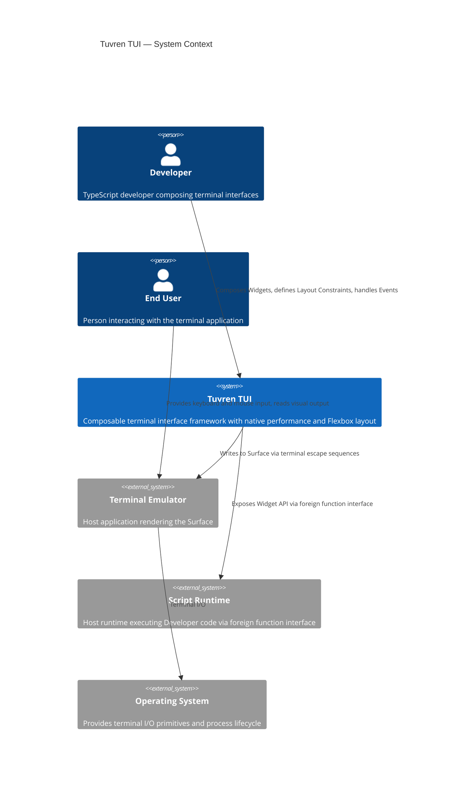
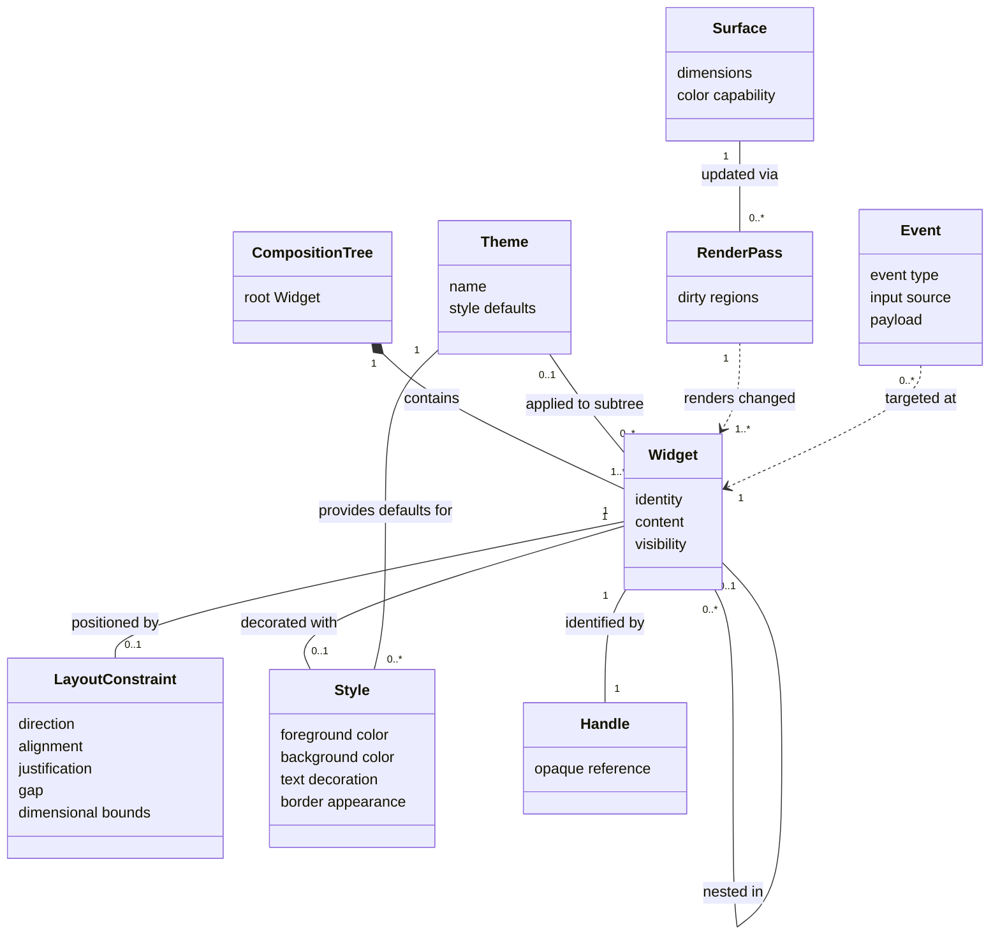

# Product Requirements Document

## 0. Version History & Changelog
- v2.5.0 - Sequenced the next framework waves as commands/keymaps, Effect, plugin slots, SDK productization, and first public npm release as a pre-GA `0.1.0` feedback loop.
- v2.4.0 - Reframed the product as a general-purpose framework, activated productization and framework-foundation scope, and adopted the future public name Tuvren with an explicit Brownfield transition note.
- v2.3.0 - Reformatted to the current stage-1 framework skeleton while preserving approved scope, roadmap context, and operator preferences.
- ... [Older history truncated, refer to git logs]

## 1. Executive Summary & Target Archetype
- **Target Archetype:** General-purpose terminal UI framework and SDK for TypeScript-first developers, with a productized imperative core as the approved public release direction and Bun-native ergonomics in the current runtime posture.
- **Vision:** Terminal interface development becomes as productive as web UI development without sacrificing performance, inspectability, or the ability to ship demanding terminal products from a TypeScript workflow.
- **Problem:** Developers building terminal applications in the TypeScript ecosystem still face a forced trade-off between ergonomic but resource-heavy solutions, performant but ergonomically hostile primitives, and toolkit surfaces that do not feel productized or extensible enough to trust for real application delivery.
- **Jobs to Be Done:**
  - Primary: "When building interactive terminal applications in TypeScript, I want a general-purpose framework with composable interface primitives, native performance, and productized release ergonomics, so I can ship polished terminal apps in hours instead of days without dropping into a systems-language-heavy workflow."
  - Secondary: "When building demanding terminal products such as agent consoles, operator dashboards, repo inspectors, or other information-dense tools, I want the same framework to stay stable under streaming output, long transcripts, dense panes, and heavy inspection surfaces."
  - Tertiary: "When using Bun as my primary runtime, I want a TUI framework designed for Bun's foreign-function model from day one, so I don't fight compatibility shims or WASM overhead."

### 1.1 Product Posture
- **Current Product Emphasis:** Tuvren tells a general-purpose framework story. Its showcase and proving grounds remain demanding agentic and developer-facing products because those workloads stress the performance, viewport, and inspectability requirements that motivated the project in the first place.
- **JTBD Priority Order:** Ship Faster > Productized Trust > Framework Foundations > Bun-native DX > Own the Full Stack

### 1.2 Capability Roadmap Context

| Wave | Scope Emphasis | Summary |
| --- | --- | --- |
| **v0** | Core interaction surface | Widget composition, layout, styling, keyboard and mouse input, scrolling, cross-platform terminal handling, and rich text rendering |
| **v1** | Product polish | Animation system and theming foundation |
| **v2** | Hardening and advanced DX | Core hardening, tree operations for reconciler support, theme inheritance, TextArea, choreography, lightweight JSX reconciler, and foundational accessibility |
| **v3** | Productization and framework foundations | Public rename to Tuvren, package topology, onboarding polish, general-purpose framework positioning, and the queued command/keymap foundation wave |
| **v4** | Declarative and extensibility expansion | Effect-based declarative integration and pre-GA plugin-slot boundaries once command/keymap foundations stabilize |
| **v5** | SDK productization and public pre-GA release | Expert-level SDK DX across imperative, JSX, Effect, plugin, composite, example, and devtools surfaces, followed by the first public npm release as `0.1.0` and a feedback loop before any `v1.0` compatibility guarantees |

### 1.3 Brownfield Transition Note
- **Public name:** `Tuvren` / `tuvren-tui` (Epic P shipped the hard-cut rename)
- **Current source-tree reality:** The repo, packages, examples, and release workflow use `Tuvren` / `tuvren-tui` naming. The rename from Kraken is complete as of Epic P.
- **Planning rule:** This PRD governs the future public product direction. Downstream artifacts must keep the current Brownfield naming explicit anywhere implementation reality still differs.

## 2. Ubiquitous Language (Glossary)
| Term | Definition | Do Not Use |
| --- | --- | --- |
| **Widget** | A composable visual building block that can display content, accept input, or contain other Widgets. | Component, Element, Node, Control |
| **Developer** | A person using Tuvren to build terminal applications. | Author, User, Consumer, Client |
| **End User** | The person interacting with the terminal application a Developer built. | User, Customer, Operator |
| **Composition Tree** | The hierarchical arrangement of Widgets that defines the interface structure. | DOM, Widget Tree, Node Tree, Scene Graph |
| **Surface** | The terminal display area to which the Composition Tree is rendered. | Screen, Canvas, View, Buffer |
| **Handle** | An opaque reference to a Widget in the native performance layer. Owned by the system, not the Developer. | Pointer, Reference, ID, Key |
| **Layout Constraint** | Rules governing a Widget's position and dimensions relative to its parent and siblings. | Style, CSS, Layout Rule |
| **Render Pass** | A single cycle from state mutation to Surface update. Only changed regions are recomputed. | Frame, Draw, Paint, Tick |
| **Event** | A discrete unit of End User input routed to the appropriate Widget. | Callback, Signal, Message, Action |

## 3. Actors & Personas
### 3.1 Primary Actor
- **Role:** The General-Purpose Terminal Application Builder
- **Context:** Comfortable with TypeScript and terminal tooling, but unwilling to spend weeks learning a new paradigm or a systems language just to ship terminal applications with professional polish.
- **Goals:** Build dashboards, inspectors, prompts, editors, and operator surfaces quickly; rely on strong defaults; reach a meaningful first application shape fast; trust the install and release path enough to recommend the framework to others.
- **Frictions:** Boilerplate-heavy frameworks, missing defaults, memory-heavy React-style solutions, unproductized install flows, and any approach that makes the first real interface take more than roughly 30 minutes.
- **Current Workarounds:** Cobbled-together ANSI escape sequences, Ink with growing memory concerns, or leaving the terminal for a web dashboard that breaks the workflow.

### 3.2 Secondary Actor
- **Role:** The Agentic Product Builder
- **Context:** Building assistants, operator consoles, repo tooling, or other long-lived terminal products where streaming output, dense panes, and stable viewports are not edge cases but the product's normal workload.
- **Goals:** Reuse the same framework for demanding agentic and developer-facing products without losing viewport stability, inspectability, or performance under continuous updates.
- **Frictions:** Host-side tree explosion, fragile viewport behavior under streaming churn, weak diagnostics, and framework stories that sound general-purpose but break down under real operator workloads.

### 3.3 Tertiary Actor
- **Role:** The Bun Ecosystem Native
- **Context:** Already committed to Bun and wants tools that feel native to the runtime rather than ported from a Node.js or browser-first worldview.
- **Goals:** Use a zero- or near-zero-dependency terminal UI framework that integrates cleanly with Bun's foreign-function model.
- **Frictions:** WASM layers, compatibility shims, polyfill-heavy stacks, and tools that feel architecturally foreign to Bun.

## 4. Functional Capabilities
### Epic 1 — Widget Composition
- **Priority:** P0
- **Capability:** A Developer can create atomic visual elements for display, input, selection, and scrolling.
- **Capability:** A Developer can compose Widgets into hierarchical layouts of arbitrary depth.
- **Capability:** A Developer can add and remove Widgets from the Composition Tree at runtime.
- **Capability:** A Developer can set and update Widget content dynamically.
- **Rationale:** Without fast composition, the framework fails its primary job of helping Developers ship polished terminal interfaces in hours instead of days.

### Epic 2 — Spatial Layout
- **Priority:** P0
- **Capability:** A Developer can define spatial relationships between Widgets using Flexbox-compatible Layout Constraints such as direction, alignment, justification, and gap.
- **Capability:** A Developer can specify dimensional bounds including fixed, percentage, min/max, flex-grow, and flex-shrink behavior.
- **Capability:** Layout resolves automatically on Composition Tree mutation without Developer intervention.
- **Capability:** Layout adapts to Surface dimensions, including terminal resize.
- **Rationale:** Familiar layout semantics are central to Tuvren's promise of web-like productivity in a terminal environment.

### Epic 3 — Visual Styling
- **Priority:** P0
- **Capability:** A Developer can apply foreground and background color to any Widget using named colors, hex values, and the 256-color palette.
- **Capability:** A Developer can apply text decoration such as bold, italic, and underline.
- **Capability:** A Developer can apply border styles to container Widgets.
- **Capability:** A Developer can batch multiple style mutations into a single Render Pass.
- **Rationale:** Terminal applications must still look polished and legible to compete with web dashboards and desktop tooling.

### Epic 4 — Input & Focus
- **Priority:** P0
- **Capability:** An End User can type text into input Widgets via keyboard.
- **Capability:** An End User can navigate between interactive Widgets via keyboard-driven focus traversal in depth-first, DOM-order sequence.
- **Capability:** An End User can select from a list of options using arrow keys and Enter.
- **Capability:** A Developer can subscribe to keyboard Events on any Widget.
- **Capability:** An End User can click a Widget to focus it.
- **Capability:** An End User can scroll via mouse wheel within scrollable regions.
- **Capability:** A Developer can subscribe to mouse Events such as click and scroll on any Widget.
- **Capability:** The system performs hit-testing to route mouse Events to the correct Widget in the Composition Tree.
- **Rationale:** Real terminal applications live or die on input correctness, focus predictability, and low-friction event handling.

### Epic 5 — Scrollable Regions
- **Priority:** P0
- **Capability:** A Developer can designate a container Widget as scrollable when content exceeds its bounds.
- **Capability:** An End User can scroll through overflow content via keyboard or mouse.
- **Capability:** Scroll position is maintained across Render Passes.
- **Rationale:** Streaming logs, transcripts, and dense inspection surfaces require reliable viewport behavior to be usable.

### Epic 6 — Cross-Platform Terminal Abstraction
- **Priority:** P0
- **Capability:** The system operates on major OS families without platform-specific Developer code.
- **Capability:** The system adapts to terminal capabilities such as color depth and dimensions.
- **Capability:** The system manages terminal mode lifecycle, including raw mode and alternate screen handling, transparently.
- **Rationale:** A terminal UI framework that requires platform-specific application code fails the "ship faster" promise for OSS and team adoption.

### Epic 7 — Rich Text Rendering
- **Priority:** P0
- **Capability:** A Developer can render Markdown-formatted text within a Widget.
- **Capability:** A Developer can render syntax-highlighted code blocks within a Widget.
- **Capability:** The system parses rich text formats into styled spans without Developer intervention.
- **Capability:** A Developer can extend the parsing pipeline with custom format handlers.
- **Rationale:** Developer tools, agent interfaces, and dense dashboards all depend on rich textual presentation rather than plain strings alone.

### Epic 8 — Animation
- **Priority:** P1
- **Capability:** A Developer can define timed transitions on Widget properties such as opacity and foreground, background, or border color.
- **Capability:** The system provides built-in animation primitives such as spinners, progress indicators, and pulsing states.
- **Capability:** Animations are frame-budget-aware and degrade gracefully under load.
- **Capability:** A Developer can cancel or chain animations programmatically.
- **Rationale:** Motion is a polish and feedback layer, not the critical path, but it materially improves perceived quality for interactive apps.

### Epic 9 — Theming
- **Priority:** P1
- **Capability:** A Developer can define a Theme as a named collection of Style defaults.
- **Capability:** A Developer can apply a Theme to a subtree of the Composition Tree.
- **Capability:** A Developer can switch Themes at runtime without rebuilding the Composition Tree.
- **Capability:** The system provides a constraint-based Theme inheritance model for nested subtrees.
- **Capability:** The system ships with at least two built-in Themes: light and dark.
- **Rationale:** Theming improves reuse, consistency, and adaptation across applications without forcing Developers to restyle every Widget manually.

### Epic 10 — Productized Installation & Release Trust
- **Priority:** P0
- **Capability:** A Developer can install the framework on supported platforms without requiring a local Rust toolchain in the ordinary public install path.
- **Capability:** A Developer receives actionable diagnostics when the native layer cannot be found or loaded.
- **Capability:** Release artifacts, package naming, and platform support feel stable and trustworthy enough for the framework to be adopted in production terminal applications.
- **Rationale:** A framework cannot compete credibly at product level if its install, release, and runtime-loading story feels like a source-checkout-only developer experience.

### Epic 11 — Commands & Keymap Foundations
- **Priority:** P0
- **Capability:** A Developer can define reusable commands and trigger them through keyboard-driven keymaps without reimplementing focus-aware dispatch and command routing in every app.
- **Capability:** The framework provides a consistent foundation for command palettes, keyboard shortcuts, and other application-level interaction patterns over the same core runtime.
- **Rationale:** Moving from a productized imperative core to a competitive framework requires first-class application orchestration primitives, and commands plus keymaps are the minimum viable moat for that transition.

### Epic 12 — Optional Declarative Integration Layer
- **Priority:** P1
- **Capability:** A Developer can opt into a declarative application model layered over the same imperative runtime contract without fragmenting the framework into separate state authorities.
- **Capability:** The imperative core remains the canonical mental model even when a declarative integration layer is used.
- **Rationale:** A competitive framework can support multiple development styles, but the declarative story must deepen adoption without undermining the clarity and authority of the core imperative runtime.

### Epic 13 — Extension Slots and Framework Contributions
- **Priority:** P1
- **Capability:** A Developer can extend framework-level services through bounded contribution points for commands, keymaps, command palettes, devtools panels, themes, and showcase/example integrations.
- **Capability:** Extension slots remain pre-GA and explicitly do not create `v1.0` compatibility guarantees before the product has real public feedback.
- **Rationale:** Extension boundaries need to exist before public adoption grows, but they must be shaped after commands/keymaps and declarative integration so the framework does not lock in the wrong host-service contract.

### Epic 14 — Expert-Level SDK Developer Experience
- **Priority:** P0
- **Capability:** A Developer can build polished TUIs through the public SDK without routine knowledge of Rust internals, raw FFI calls, numeric Handles, or native lifecycle details.
- **Capability:** Imperative, JSX, Effect, plugin, composite, example, and devtools surfaces feel coherent, documented, and production-grade before the first public npm release.
- **Rationale:** Public publishing should expose a framework-quality SDK, not merely a strong native engine with bindings.

## 5. Non-Functional Constraints
| Constraint Area | Requirement | Rationale |
| --- | --- | --- |
| **Performance** | Memory stays below 20MB for a composition of 100 Widgets. | Supports constrained environments such as CI runners, containers, and remote servers. |
| **Performance** | Input latency stays below 50ms from keystroke to Surface update. | Keeps interaction below the threshold where terminal UIs feel sluggish. |
| **Performance** | A Render Pass stays below 16ms when operating within the intended workload envelope. | Preserves 60fps-capable responsiveness for real-time dashboards and streaming workflows. |
| **Performance** | Foreign-function overhead stays below 1ms per cross-boundary call. | Ensures the language boundary does not become the bottleneck. |
| **Operability** | The host-language package stays below 75KB. | Keeps the TypeScript layer intentionally thin so the value remains in the Native Core. |
| **Operability** | Supported public releases install and load on the supported glibc-based Linux, macOS, and Windows targets without requiring a local source build in the ordinary path. | Productized adoption depends on a trustworthy install path, not just a strong source-checkout story. |
| **Operability** | Every supported public release target in the published matrix receives install and load smoke verification before the productization wave is considered complete. | Cross-platform credibility is part of the framework promise, not an optional afterthought. |
| **Adoption** | Time to Hello World stays below 15 minutes for a competent TypeScript Developer. | Reinforces the primary JTBD: shipping faster. |
| **Adoption** | The public story must be understandable as a general-purpose framework without hiding the demanding agentic/operator workloads that prove the design under stress. | The framework needs broad appeal without losing the concrete workload that justifies its deeper architecture. |
| **Adoption** | Ordinary SDK workflows do not require Developers to reach for raw FFI or numeric Handle plumbing. | Expert-level DX is required before the first public npm release can represent the framework credibly. |
| **Stability** | Semantic versioning guarantees begin at public v1.0 GA; pre-GA releases may include breaking changes. | Sets realistic trust expectations for open source adoption. |
| **Contributor Experience** | Module boundaries, architecture decisions, and build environment remain understandable and reproducible. | Makes contribution and long-term maintenance realistic. |
| **Accessibility** | Accessibility is not a v0/v1 hard constraint and is tracked as a v2 commitment. | Keeps MVP scope disciplined while preserving accessibility as a real product requirement. |

## 6. Boundary Analysis
### In Scope
- General-purpose framework support for terminal dashboards, interactive CLIs, inspectors, editors, and operator-facing interfaces.
- Composable Widget system for terminal dashboards and interactive CLI interfaces.
- Flexbox-compatible layout resolution.
- Keyboard-driven interaction with focus management.
- Mouse interaction including click-to-focus, scroll, and hit-testing.
- Rich text rendering including Markdown, syntax highlighting, and extensible parser pipelines.
- Imperative composition API as the primary mental model.
- Productized installation, release, and onboarding experience for supported platforms.
- Framework-level command and keybinding foundations over the same imperative runtime.
- An optional declarative integration layer over the same runtime contract, without introducing a second mutable UI authority.
- Pre-GA plugin and contribution slots for framework-level services after command/keymap and declarative contracts stabilize.
- Expert-level SDK productization across imperative, JSX, Effect, plugin, composite, example, and devtools surfaces before first public npm publish.
- Incremental rendering through dirty-region tracking.
- Cross-platform terminal abstraction.
- Scrollable regions.
- Long-lived transcript and log-style workflows where content updates continuously while the End User reads older content.
- Dense multi-pane developer and agent interfaces that combine navigation, inspection, and live output in a single Surface.
- Internal debugging and inspection workflows that help the Developer understand layout, focus, rendering, and event behavior while building such applications.
- Animation system and theming foundation as delivered product capabilities.
- Core hardening, reconciler support, advanced editing, and foundational accessibility as delivered v2 scope.

### Out of Scope
- Select-widget search and filter in the v0 capability set.
- Full screen-reader integration beyond foundational accessibility.
- Internationalization features such as RTL layout support and localization hooks.
- Widget state persistence through serialization and deserialization of the Composition Tree.
- Background render threading as part of the default product contract unless later evidence justifies promotion.
- React or Solid parity as the public declarative strategy for the current roadmap.
- Stable plugin-slot compatibility guarantees before `v1.0` GA.
- Plugin-slot extensibility before command/keymap foundations plus the declarative integration layer stabilize.
- Host runtime expansion beyond the current Bun-first public posture for the immediate roadmap wave.
- Broad new widget breadth as a substitute for productization, release trust, and framework-level interaction foundations.
- Public musl/Alpine Linux support until the Bun-first native-package enforcement strategy is proven.

## 7. Conceptual Diagrams (Mermaid)
### 7.1 System Context

### 7.2 Domain Model

## Appendix: Operator Preferences
_The following are developer-stated implementation preferences. They are preserved for downstream stages but are not product requirements by themselves._

| Preference | Value |
| --- | --- |
| Future public product name | `Tuvren` |
| Future public package name | `tuvren-tui` |
| Hosting organization move | Complete; canonical remote is `Tuvren/tuvren-tui` |
| First public npm release | `0.1.0` pre-GA after SDK productization; `v1.0` compatibility guarantees come later |
| Core implementation language | Rust |
| Target runtime | Bun |
| FFI mechanism | `bun:ffi` |
| Layout engine | Taffy |
| Terminal backend | crossterm |
| Future declarative path | Imperative core remains canonical; declarative integration should center on `Effect`, not React or Solid parity |
| Build artifact | `cdylib` |
| Dev environment | `devenv` (Nix) |
