# Engineering Execution Plan

## 0. Version History & Changelog
- v7.9.0 - Planned the full Epics R-V sequence: commands/keymaps, Effect, pre-GA plugin slots, SDK productization, and first public npm publish as `0.1.0`.
- v7.8.0 - Marked Epic Q shipped after the adoption and framework positioning wave landed: README rewritten as a general-purpose framework with public install path and Hello World, example framing updated into two tiers (general-purpose demos and flagship workload proofs), and Kraken-to-Tuvren hard-cut migration guide published at `docs/migration/kraken-to-tuvren.md`. Epic R is now the next queued wave.
- v7.7.0 - Marked Epic P shipped after the full hard-cut Tuvren rename landed: package name, host facade, error type, native crate and library names, resolver env var, auxiliary scoped native package topology, release workflow, cross-platform CI smoke gate, and all bench, test, and example surfaces updated. Epic Q is now the only active wave.
- v7.6.0 - Activated the first post-Epic-O roadmap wave: Epic P covers the hard-cut Tuvren rename plus packaging and release trust, Epic Q covers adoption and framework positioning, and future framework expansion is staged as commands/keymaps, Effect, and then deferred plugin-slot work.
- ... [Older history truncated, refer to git logs]

## 1. Executive Summary & Active Critical Path
- **Total Active Story Points:** 123
- **Critical Path:** `CMD-R001 -> CMD-R002 -> CMD-R003 -> CMD-R004 -> CMD-R005 -> CMD-R006 -> EFF-S001 -> EFF-S002 -> EFF-S003 -> EFF-S004 -> EFF-S005 -> EXT-T001 -> EXT-T002 -> EXT-T003 -> EXT-T004 -> EXT-T005 -> EXT-T006 -> SDK-U001 -> SDK-U002 -> SDK-U003 -> SDK-U004 -> SDK-U005 -> SDK-U006 -> SDK-U007 -> PUB-V001 -> PUB-V002 -> PUB-V003 -> PUB-V004 -> PUB-V005 -> PUB-V006 -> PUB-V007`
- **Planning Assumptions:**
  - Epic M, Epic N, Epic O, Epic P, and Epic Q are all shipped. The Brownfield source now includes the native text substrate, transcript and split-pane semantics, devtools, terminal-capability hardening, the full Tuvren hard-cut rename, and the general-purpose framework onboarding and migration story.
  - The GitHub repository move is complete; the canonical remote is `Tuvren/tuvren-tui`. The local checkout directory may still be named `KrakenTUI` until the operator renames it.
  - The product story is **general-purpose framework first**, with agentic and transcript-heavy products as the flagship showcase and harshest proof workload. This positioning is now reflected in the README and example framing.
  - Bun remains the only supported runtime in the active contract. Node portability is deferred.
  - The following framework waves are intentionally sequenced: commands and keymaps (Epic R), real optional Effect integration (Epic S), pre-GA plugin slots (Epic T), expert-level SDK DX productization (Epic U), and first public npm publish plus feedback loop (Epic V).
  - First public npm publish is planned as `0.1.0` pre-GA, not `v1.0`; breaking changes remain allowed before public `v1.0 GA`.
  - React and Solid parity are not roadmap goals in this planning wave.

## 2. Project Phasing & Iteration Strategy
### Current Active Scope

- **Epic R — Commands & Keymap Foundations:** First framework-level host services over the imperative core and native event stream.
- **Epic S — Effect Declarative Integration:** A real optional `tuvren-tui/effect` integration using the official `effect` package while keeping the root package imperative-first.
- **Epic T — Plugin Slots and Extensibility:** Pre-GA contribution points for commands, keymaps, palettes, devtools panels, themes, and showcase/example integrations.
- **Epic U — SDK Productization / Expert-Level DX:** Productize all public SDK surfaces before npm publish: imperative, JSX, Effect, plugins, composites, examples, and devtools.
- **Epic V — First Public npm Publish and Feedback Loop:** Publish `tuvren-tui@0.1.0` plus auxiliary native packages and establish post-publish feedback triage.

### Future / Deferred Scope
- No Node runtime portability in the active wave.
- No React or Solid parity work; the declarative strategy is `Effect`, not framework-adapter breadth.
- No `v1.0` compatibility guarantee in Epics R-V; plugin slots and Effect integration remain pre-GA.
- No generic widget-breadth wave as a substitute for productization and framework ergonomics.
- No default background-render promotion while synchronous semantics remain the canonical contract.
- No clipboard read support, Kitty graphics, sixel, inline image protocols, or advanced MIME clipboard work in the active wave.
- No public musl/Alpine support before a separate release-matrix decision.

### Archived or Already Completed Scope
- Epic Q (Adoption and Framework Positioning) shipped the general-purpose framework README, two-tier example framing, and Kraken-to-Tuvren migration guide.
- Epic P (Tuvren Identity, Packaging, and Release Migration) shipped the hard-cut Tuvren rename, package topology, resolver contract, release workflow, cross-platform smoke gate, and surface-wide bench/test/example updates.
- Epic O (Terminal Capability Hardening) shipped terminal protocol detection, degraded multiplexer policy, Kitty keyboard negotiation, OSC52 writes, OSC8 links, runtime capability reporting, and terminal-hardening coverage.
- Epic N (Substrate Surface Rebase) shipped substrate-backed text rendering, native edit-buffer semantics, TextArea rebasing, transcript substrate migration, and benchmark coverage.
- Epic M (Native Text Substrate) shipped the native text substrate, text view, unified text renderer, and Unicode/wrapping gate suite.
- Earlier archived waves shipped native transcript state, anchor-based viewport behavior, nested scroll handoff, devtools APIs, host inspector surfaces, split-pane layout, transcript-backed composites, flagship examples, and canonical docs normalization.

## 3. Build Order (Mermaid)

```mermaid
flowchart LR
    O[Epic O Terminal Capability Hardening - SHIPPED]:::done
    P[Epic P Tuvren Identity and Release Migration - SHIPPED]:::done
    Q[Epic Q Adoption and Framework Positioning - SHIPPED]:::done
    R1[CMD-R001]
    R2[CMD-R002]
    R3[CMD-R003]
    R4[CMD-R004]
    R5[CMD-R005]
    R6[CMD-R006]
    S1[EFF-S001]
    S2[EFF-S002]
    S3[EFF-S003]
    S4[EFF-S004]
    S5[EFF-S005]
    T1[EXT-T001]
    T2[EXT-T002]
    T3[EXT-T003]
    T4[EXT-T004]
    T5[EXT-T005]
    T6[EXT-T006]
    U1[SDK-U001]
    U2[SDK-U002]
    U3[SDK-U003]
    U4[SDK-U004]
    U5[SDK-U005]
    U6[SDK-U006]
    U7[SDK-U007]
    V1[PUB-V001]
    V2[PUB-V002]
    V3[PUB-V003]
    V4[PUB-V004]
    V5[PUB-V005]
    V6[PUB-V006]
    V7[PUB-V007]

    O --> P
    P --> Q
    Q --> R1
    R1 --> R2
    R1 --> R3
    R2 --> R3
    R2 --> R4
    R3 --> R4
    R4 --> R5
    R5 --> R6
    R6 --> S1
    S1 --> S2
    S2 --> S3
    S3 --> S4
    R4 --> S4
    S4 --> S5
    S5 --> T1
    T1 --> T2
    T2 --> T3
    R5 --> T3
    T2 --> T4
    T3 --> T5
    T4 --> T5
    T5 --> T6
    T6 --> U1
    U1 --> U2
    U1 --> U3
    U2 --> U4
    U3 --> U4
    U4 --> U5
    U4 --> U6
    U5 --> U7
    U6 --> U7
    U7 --> V1
    V1 --> V2
    V2 --> V3
    V3 --> V4
    V4 --> V5
    V5 --> V6
    V6 --> V7

    class O,P,Q done;
    class R1,R2,R3,R4,R5,R6,S1,S2,S3,S4,S5,T1,T2,T3,T4,T5,T6,U1,U2,U3,U4,U5,U6,U7,V1,V2,V3,V4,V5,V6,V7 active;
    classDef done fill:#dff5dd,stroke:#3f9d3f,color:#1f4d1f;
    classDef active fill:#fff4d6,stroke:#d39b14,color:#5c4100;
    classDef future fill:#e6eefc,stroke:#4c78d0,color:#14315f;
```


## 4. Ticket List

### Epic R — Commands & Keymap Foundations (CMD)

**CMD-R001 Ratify Commands and Keymap Contract**
- **Type:** Spike
- **Effort:** 3
- **Dependencies:** Epic Q shipped
- **Capability / Contract Mapping:** [PRD](./PRD.md) §4 Epic 11, [Architecture](./Architecture.md) §4.5, [TechSpec](./TechSpec.md) ADR-T44 and §4.4
- **Description:** Finalize the host-layer command, keymap, context, and dispatch contract before implementation.
- **Acceptance Criteria (Gherkin):**
```gherkin
Given the approved Commands and Keymaps scope
When the contract spike is complete
Then command IDs, command context, keybinding syntax, conflict behavior, and focus-context requirements are documented
And the contract preserves the Native Core as the single mutable UI authority
And no plugin-slot work is required before CMD-R002 begins
```

**CMD-R002 Add Command Registry and Typed Command Model**
- **Type:** Feature
- **Effort:** 5
- **Dependencies:** CMD-R001
- **Capability / Contract Mapping:** [TechSpec](./TechSpec.md) §4.4
- **Description:** Add a host-side command registry with typed command definitions, disposable registration, listing, and programmatic execution.
- **Acceptance Criteria (Gherkin):**
```gherkin
Given a Developer registers commands through the public SDK
When commands are listed or executed by ID
Then registered commands run with a typed CommandContext
And duplicate or malformed command registrations fail with actionable errors
And unregistering a command removes it from later dispatch
```

**CMD-R003 Add Keymap Resolver and Binding Normalization**
- **Type:** Feature
- **Effort:** 5
- **Dependencies:** CMD-R001, CMD-R002
- **Capability / Contract Mapping:** [Architecture](./Architecture.md) §4.5, [TechSpec](./TechSpec.md) §4.4
- **Description:** Add keybinding registration and normalized resolution for key events, modifiers, focus predicates, and command lookup.
- **Acceptance Criteria (Gherkin):**
```gherkin
Given registered keybindings and drained key events
When the resolver evaluates an event
Then the matching command is selected only when its binding and predicate match
And unsupported or ambiguous binding strings fail during registration
And resolution does not invent host-owned focus state
```

**CMD-R004 Integrate Command Dispatch with Event Loops**
- **Type:** Feature
- **Effort:** 5
- **Dependencies:** CMD-R002, CMD-R003
- **Capability / Contract Mapping:** [TechSpec](./TechSpec.md) §4.4
- **Description:** Wire command dispatch into `app.run()`, `createLoop()`, and manual-loop helper APIs without changing the native event delivery model.
- **Acceptance Criteria (Gherkin):**
```gherkin
Given an application uses the runner loop
When a registered keybinding event is drained
Then the bound command executes before the next render pass
And applications can opt out or override command dispatch
And manual event loops can call the same dispatcher explicitly
```

**CMD-R005 Rebase CommandPalette on Command Registry**
- **Type:** Feature
- **Effort:** 3
- **Dependencies:** CMD-R004
- **Capability / Contract Mapping:** [PRD](./PRD.md) §4 Epic 11, [TechSpec](./TechSpec.md) §4.4
- **Description:** Make `CommandPalette` consume the command registry rather than requiring examples to maintain separate command arrays and manual shortcut handling.
- **Acceptance Criteria (Gherkin):**
```gherkin
Given a CommandPalette is connected to a command registry
When it opens and filters commands
Then it displays registered commands and executes the selected command through the registry
And existing palette examples no longer duplicate command dispatch logic
```

**CMD-R006 Add Commands/Keymaps Tests, Examples, and Docs**
- **Type:** Chore
- **Effort:** 3
- **Dependencies:** CMD-R005
- **Capability / Contract Mapping:** [TechSpec](./TechSpec.md) §5.3 and §5.4
- **Description:** Add focused coverage and examples for registry behavior, keymap resolution, loop dispatch, palette integration, and docs.
- **Acceptance Criteria (Gherkin):**
```gherkin
Given the Commands and Keymaps epic is complete
When the host test suite and examples run
Then command registration, keybinding resolution, dispatch ordering, and palette integration are covered
And the README and examples show the command/keymap happy path
```

### Epic S — Effect Declarative Integration (EFF)

**EFF-S001 Ratify Effect Integration Contract**
- **Type:** Spike
- **Effort:** 3
- **Dependencies:** Epic R shipped
- **Capability / Contract Mapping:** [PRD](./PRD.md) §4 Epic 12, [TechSpec](./TechSpec.md) ADR-T45 and §4.5
- **Description:** Finalize the optional `tuvren-tui/effect` contract over the official `effect` package.
- **Acceptance Criteria (Gherkin):**
```gherkin
Given the approved Effect direction
When the contract spike is complete
Then dependency placement, scope lifecycle, event streams, command bindings, and examples are documented
And the root imperative package remains the canonical surface
```

**EFF-S002 Add Optional Effect Dependency and Subpath Wiring**
- **Type:** Feature
- **Effort:** 3
- **Dependencies:** EFF-S001
- **Capability / Contract Mapping:** [TechSpec](./TechSpec.md) §1.2 and §4.5
- **Description:** Add the Effect dependency and wire the optional subpath so Effect usage is explicit and isolated from ordinary imperative imports.
- **Acceptance Criteria (Gherkin):**
```gherkin
Given a Developer imports from tuvren-tui/effect
When the module loads
Then the Effect integration APIs are available
And ordinary imports from tuvren-tui do not require Effect-specific setup
```

**EFF-S003 Implement Effect Scope and Resource Lifecycle Adapters**
- **Type:** Feature
- **Effort:** 5
- **Dependencies:** EFF-S002
- **Capability / Contract Mapping:** [TechSpec](./TechSpec.md) §4.5
- **Description:** Map Tuvren app/widget lifecycle cleanup into Effect scopes and resources.
- **Acceptance Criteria (Gherkin):**
```gherkin
Given a Tuvren app or widget is managed through Effect
When its scope exits
Then registered cleanup for widgets, themes, loops, and subscriptions runs deterministically
And cleanup failures surface through the Effect error channel
```

**EFF-S004 Add Effect Event Streams and Command Dispatch Bindings**
- **Type:** Feature
- **Effort:** 5
- **Dependencies:** EFF-S003, CMD-R004
- **Capability / Contract Mapping:** [TechSpec](./TechSpec.md) §4.4 and §4.5
- **Description:** Expose drained Tuvren events and command dispatch through Effect-friendly stream and service adapters.
- **Acceptance Criteria (Gherkin):**
```gherkin
Given an Effect-based Tuvren application
When input events are drained or commands are dispatched
Then the Effect adapters expose those flows without bypassing the host runner contract
And command failures are observable through Effect failure handling
```

**EFF-S005 Add Effect Examples, Tests, and Docs**
- **Type:** Chore
- **Effort:** 3
- **Dependencies:** EFF-S004
- **Capability / Contract Mapping:** [TechSpec](./TechSpec.md) §5.3
- **Description:** Add coverage and public examples for the Effect happy path.
- **Acceptance Criteria (Gherkin):**
```gherkin
Given the Effect integration is implemented
When examples and tests run
Then scope cleanup, event streaming, command dispatch, and docs snippets are covered
And docs clearly present Effect as optional rather than replacing the imperative core
```

### Epic T — Plugin Slots and Extensibility (EXT)

**EXT-T001 Ratify Plugin Slot Contract**
- **Type:** Spike
- **Effort:** 3
- **Dependencies:** Epic S shipped
- **Capability / Contract Mapping:** [PRD](./PRD.md) §4 Epic 13, [Architecture](./Architecture.md) §4.6, [TechSpec](./TechSpec.md) ADR-T46 and §4.6
- **Description:** Finalize pre-GA plugin boundaries and contribution slot responsibilities.
- **Acceptance Criteria (Gherkin):**
```gherkin
Given commands/keymaps and Effect are available
When the plugin-slot contract is ratified
Then supported contribution types, lifecycle hooks, diagnostics, and pre-GA compatibility posture are documented
And plugins cannot own native Widget state
```

**EXT-T002 Add Extension Registry and Lifecycle API**
- **Type:** Feature
- **Effort:** 5
- **Dependencies:** EXT-T001
- **Capability / Contract Mapping:** [TechSpec](./TechSpec.md) §4.6
- **Description:** Add extension registration, activation, deactivation, subscriptions, and diagnostics.
- **Acceptance Criteria (Gherkin):**
```gherkin
Given an extension is registered
When it activates and later deactivates
Then its contributed resources are tracked and disposed
And activation failures are isolated and reported with the extension ID
```

**EXT-T003 Add Command, Keymap, and Palette Contribution Slots**
- **Type:** Feature
- **Effort:** 5
- **Dependencies:** EXT-T002, CMD-R005
- **Capability / Contract Mapping:** [TechSpec](./TechSpec.md) §4.4 and §4.6
- **Description:** Allow extensions to contribute commands, keybindings, and palette-visible command metadata.
- **Acceptance Criteria (Gherkin):**
```gherkin
Given an extension contributes commands and keymaps
When the extension is active
Then its commands appear in registry-backed dispatch and palettes
And deactivation removes those contributions
```

**EXT-T004 Add Devtools, Theme, and Showcase Contribution Slots**
- **Type:** Feature
- **Effort:** 5
- **Dependencies:** EXT-T002
- **Capability / Contract Mapping:** [PRD](./PRD.md) §4 Epic 13
- **Description:** Allow extensions to contribute bounded devtools panels, theme presets, and showcase/example metadata.
- **Acceptance Criteria (Gherkin):**
```gherkin
Given an extension contributes devtools, theme, or showcase entries
When the host enumerates those contributions
Then they are available through public registries without private native access
And invalid contributions fail during registration
```

**EXT-T005 Add Plugin Safety, Compatibility, and Diagnostics Rules**
- **Type:** Chore
- **Effort:** 3
- **Dependencies:** EXT-T003, EXT-T004
- **Capability / Contract Mapping:** [TechSpec](./TechSpec.md) ADR-T46
- **Description:** Add diagnostics, docs, and compatibility labels for pre-GA plugin APIs.
- **Acceptance Criteria (Gherkin):**
```gherkin
Given plugin APIs are pre-GA
When a Developer reads diagnostics or docs
Then the unsupported behaviors, lifecycle expectations, and breaking-change posture are explicit
And plugin failures do not obscure the owning extension ID
```

**EXT-T006 Add Plugin Examples, Tests, and Docs**
- **Type:** Chore
- **Effort:** 3
- **Dependencies:** EXT-T005
- **Capability / Contract Mapping:** [TechSpec](./TechSpec.md) §5.3
- **Description:** Add example extensions and tests for all supported contribution slots.
- **Acceptance Criteria (Gherkin):**
```gherkin
Given plugin slots are implemented
When the host tests and examples run
Then command, keymap, palette, devtools, theme, and showcase contributions are covered
And docs present plugins as pre-GA contribution points
```

### Epic U — SDK Productization / Expert-Level DX (SDK)

**SDK-U001 Audit SDK DX and Public Surface Gaps**
- **Type:** Spike
- **Effort:** 3
- **Dependencies:** Epic T shipped
- **Capability / Contract Mapping:** [PRD](./PRD.md) §4 Epic 14, [TechSpec](./TechSpec.md) ADR-T47 and §4.7
- **Description:** Audit imperative, JSX, Effect, plugin, composite, example, and devtools surfaces for raw handle, FFI, lifecycle, documentation, and wrapper gaps.
- **Acceptance Criteria (Gherkin):**
```gherkin
Given the SDK surfaces after Epic T
When the audit completes
Then every routine raw FFI or numeric Handle dependency in examples and docs is classified
And the Epic U implementation tickets have a prioritized gap list
```

**SDK-U002 Add Handle-Safe Event and Focus Ergonomics**
- **Type:** Feature
- **Effort:** 5
- **Dependencies:** SDK-U001
- **Capability / Contract Mapping:** [TechSpec](./TechSpec.md) §4.7
- **Description:** Add public ergonomics so ordinary event and focus handling can avoid numeric Handle comparison.
- **Acceptance Criteria (Gherkin):**
```gherkin
Given an application handles events or focus
When it uses the public SDK happy path
Then it can identify target widgets through handle-safe references or helpers
And raw numeric Handle plumbing is only needed for advanced internals
```

**SDK-U003 Close Wrapper Gaps and Remove Example FFI Dependence**
- **Type:** Feature
- **Effort:** 5
- **Dependencies:** SDK-U001
- **Capability / Contract Mapping:** [TechSpec](./TechSpec.md) §4.7
- **Description:** Add missing public wrappers where examples currently reach into `ffi.*` for routine widget state.
- **Acceptance Criteria (Gherkin):**
```gherkin
Given the public examples build real TUI workflows
When they need ordinary widget values or state
Then they use public SDK wrappers rather than direct ffi calls
And any remaining direct ffi usage is isolated as advanced/internal demonstration code
```

**SDK-U004 Improve App, Widget, Theme, and Plugin Lifecycle Ergonomics**
- **Type:** Feature
- **Effort:** 5
- **Dependencies:** SDK-U002, SDK-U003
- **Capability / Contract Mapping:** [TechSpec](./TechSpec.md) ADR-T47
- **Description:** Improve cleanup and lifecycle APIs across apps, widgets, themes, Effect scopes, and extensions.
- **Acceptance Criteria (Gherkin):**
```gherkin
Given an application creates SDK resources
When it exits normally or through an error path
Then cleanup helpers dispose resources predictably
And docs show the preferred lifecycle pattern for each public surface
```

**SDK-U005 Rework Imperative, JSX, Effect, and Plugin Examples**
- **Type:** Chore
- **Effort:** 5
- **Dependencies:** SDK-U004
- **Capability / Contract Mapping:** [PRD](./PRD.md) §5 Adoption constraints
- **Description:** Rework examples so each public development style has a clear, polished happy path.
- **Acceptance Criteria (Gherkin):**
```gherkin
Given a Developer evaluates Tuvren examples
When they inspect imperative, JSX, Effect, and plugin examples
Then each example demonstrates the recommended public SDK path
And examples avoid internal implementation details unless explicitly labeled advanced
```

**SDK-U006 Polish Diagnostics, Devtools, and Error Guidance**
- **Type:** Chore
- **Effort:** 3
- **Dependencies:** SDK-U004
- **Capability / Contract Mapping:** [Architecture](./Architecture.md) §5.3, [TechSpec](./TechSpec.md) §4.7
- **Description:** Improve diagnostics and docs for resolver errors, lifecycle mistakes, command/plugin failures, devtools inspection, and debugging.
- **Acceptance Criteria (Gherkin):**
```gherkin
Given a Developer hits a common SDK error
When the error or diagnostic is shown
Then it explains the likely cause, remediation, and relevant public API
And devtools documentation points to the maintained inspection path
```

**SDK-U007 Add SDK Productization Gate and Docs Review**
- **Type:** Chore
- **Effort:** 3
- **Dependencies:** SDK-U005, SDK-U006
- **Capability / Contract Mapping:** [TechSpec](./TechSpec.md) ADR-T47, [docs/reports/GatePolicy.md](./reports/GatePolicy.md)
- **Description:** Add a release-readiness gate for expert-level SDK DX before npm publish.
- **Acceptance Criteria (Gherkin):**
```gherkin
Given Epic U is complete
When the SDK productization gate runs
Then public examples, docs, wrapper coverage, lifecycle guidance, diagnostics, and bundle budget are reviewed
And Epic V cannot begin until the gate is green
```

### Epic V — First Public npm Publish and Feedback Loop (PUB)

**PUB-V001 Audit First Public Publish Contract**
- **Type:** Spike
- **Effort:** 3
- **Dependencies:** Epic U shipped
- **Capability / Contract Mapping:** [PRD](./PRD.md) §4 Epic 10, [TechSpec](./TechSpec.md) ADR-T48 and §4.3
- **Description:** Audit the first public npm publish requirements for `tuvren-tui@0.1.0` and matching auxiliary packages.
- **Acceptance Criteria (Gherkin):**
```gherkin
Given the SDK is productized
When the publish audit completes
Then package metadata, registry access, publish tokens, release workflow, platform payloads, and smoke requirements are documented
And any blocker is resolved before PUB-V002
```

**PUB-V002 Finalize Package Metadata, LICENSE Payloads, and README Packaging**
- **Type:** Chore
- **Effort:** 3
- **Dependencies:** PUB-V001
- **Capability / Contract Mapping:** [TechSpec](./TechSpec.md) ADR-T48
- **Description:** Finalize package metadata, `files` arrays, README/license payloads, repository URLs, and pre-GA messaging for public npm packages.
- **Acceptance Criteria (Gherkin):**
```gherkin
Given npm packages are prepared for public publish
When package metadata and payload lists are reviewed
Then each package contains required LICENSE and README material
And package URLs point to Tuvren/tuvren-tui
And pre-GA `0.1.0` messaging is explicit
```

**PUB-V003 Add npm Publish Workflow for Public and Auxiliary Packages**
- **Type:** Feature
- **Effort:** 5
- **Dependencies:** PUB-V002
- **Capability / Contract Mapping:** [TechSpec](./TechSpec.md) §4.3
- **Description:** Add release workflow steps to publish `tuvren-tui` and all auxiliary native packages with provenance-appropriate gating.
- **Acceptance Criteria (Gherkin):**
```gherkin
Given a release tag for v0.1.0
When the publish workflow runs with required secrets
Then the public package and matching auxiliary packages are published in dependency-safe order
And failed publishes stop before promotion
And GitHub release artifacts remain available for manual acquisition
```

**PUB-V004 Add Aux-Package Resolver Smoke Against Packed/Registry Packages**
- **Type:** Feature
- **Effort:** 5
- **Dependencies:** PUB-V003
- **Capability / Contract Mapping:** [TechSpec](./TechSpec.md) §4.3, [docs/reports/GatePolicy.md](./reports/GatePolicy.md)
- **Description:** Add smoke tests proving the resolver can load an auxiliary package path from packed or registry-installed packages rather than only source builds.
- **Acceptance Criteria (Gherkin):**
```gherkin
Given a clean package-manager install using published or packed packages
When Tuvren resolves the native library
Then it finds the matching auxiliary package by package name
And ordinary published installs do not fall back to source builds
```

**PUB-V005 Run Release Candidate Dry-Run and Cross-Platform Install Smoke**
- **Type:** Chore
- **Effort:** 5
- **Dependencies:** PUB-V004
- **Capability / Contract Mapping:** [PRD](./PRD.md) §5, [docs/reports/GatePolicy.md](./reports/GatePolicy.md)
- **Description:** Run a release-candidate verification pass across supported platforms before public publish.
- **Acceptance Criteria (Gherkin):**
```gherkin
Given a v0.1.0 release candidate
When the dry-run and smoke matrix complete
Then supported platforms install and load successfully
And linux-arm64 limitations or runner gaps are explicitly recorded
And no publish step runs before the dry-run passes
```

**PUB-V006 Publish `v0.1.0` Public npm Release**
- **Type:** Chore
- **Effort:** 3
- **Dependencies:** PUB-V005
- **Capability / Contract Mapping:** [TechSpec](./TechSpec.md) ADR-T48
- **Description:** Publish `tuvren-tui@0.1.0` and matching auxiliary native packages to npm.
- **Acceptance Criteria (Gherkin):**
```gherkin
Given the release candidate has passed
When the v0.1.0 publish runs
Then the public package and all supported auxiliary packages are available from npm
And README install guidance works through bun add tuvren-tui
And release notes state that the package is pre-GA
```

**PUB-V007 Add Feedback Intake and Post-Publish Triage Loop**
- **Type:** Chore
- **Effort:** 3
- **Dependencies:** PUB-V006
- **Capability / Contract Mapping:** [PRD](./PRD.md) §1.1 and §5
- **Description:** Establish a feedback loop for install, DX, platform, and API issues after the first public release.
- **Acceptance Criteria (Gherkin):**
```gherkin
Given v0.1.0 is public
When users report install or SDK feedback
Then the repo has documented issue labels, triage expectations, and follow-up planning hooks
And feedback can inform the post-v0.1 roadmap before v1.0 commitments
```

## 5. Active Ticket Summary Table

### 5.1 Active Epics R-V

| ID | Epic | Type | SP | Dependencies | Phase |
| --- | --- | --- | --- | --- | --- |
| CMD-R001 | R | Spike | 3 | Epic Q shipped | Active |
| CMD-R002 | R | Feature | 5 | CMD-R001 | Active |
| CMD-R003 | R | Feature | 5 | CMD-R001, CMD-R002 | Active |
| CMD-R004 | R | Feature | 5 | CMD-R002, CMD-R003 | Active |
| CMD-R005 | R | Feature | 3 | CMD-R004 | Active |
| CMD-R006 | R | Chore | 3 | CMD-R005 | Active |
| EFF-S001 | S | Spike | 3 | Epic R shipped | Active |
| EFF-S002 | S | Feature | 3 | EFF-S001 | Active |
| EFF-S003 | S | Feature | 5 | EFF-S002 | Active |
| EFF-S004 | S | Feature | 5 | EFF-S003, CMD-R004 | Active |
| EFF-S005 | S | Chore | 3 | EFF-S004 | Active |
| EXT-T001 | T | Spike | 3 | Epic S shipped | Active |
| EXT-T002 | T | Feature | 5 | EXT-T001 | Active |
| EXT-T003 | T | Feature | 5 | EXT-T002, CMD-R005 | Active |
| EXT-T004 | T | Feature | 5 | EXT-T002 | Active |
| EXT-T005 | T | Chore | 3 | EXT-T003, EXT-T004 | Active |
| EXT-T006 | T | Chore | 3 | EXT-T005 | Active |
| SDK-U001 | U | Spike | 3 | Epic T shipped | Active |
| SDK-U002 | U | Feature | 5 | SDK-U001 | Active |
| SDK-U003 | U | Feature | 5 | SDK-U001 | Active |
| SDK-U004 | U | Feature | 5 | SDK-U002, SDK-U003 | Active |
| SDK-U005 | U | Chore | 5 | SDK-U004 | Active |
| SDK-U006 | U | Chore | 3 | SDK-U004 | Active |
| SDK-U007 | U | Chore | 3 | SDK-U005, SDK-U006 | Active |
| PUB-V001 | V | Spike | 3 | Epic U shipped | Active |
| PUB-V002 | V | Chore | 3 | PUB-V001 | Active |
| PUB-V003 | V | Feature | 5 | PUB-V002 | Active |
| PUB-V004 | V | Feature | 5 | PUB-V003 | Active |
| PUB-V005 | V | Chore | 5 | PUB-V004 | Active |
| PUB-V006 | V | Chore | 3 | PUB-V005 | Active |
| PUB-V007 | V | Chore | 3 | PUB-V006 | Active |
|  |  | **TOTAL** | **123** |  |  |

## 6. Archived Continuity Summary

### 6.1 Archived Epic Q — Adoption and Framework Positioning

Epic Q is archived as a shipped adoption wave. It repositioned Tuvren as a general-purpose terminal UI framework, refreshed README onboarding, organized examples into general-purpose and flagship workload tiers, and published the hard-cut Kraken-to-Tuvren migration guide.

### 6.2 Archived Epic P — Tuvren Identity, Packaging, and Release Migration

Epic P is archived as a shipped identity and packaging wave. It completed the hard-cut Tuvren rename across TypeScript, Rust, environment variables, shared-library names, resolver diagnostics, release assets, auxiliary native package stubs, and cross-platform smoke verification.

### 6.3 Archived v7 Docs-Maintenance Wave

The archived docs-maintenance wave normalized the canonical PRD, Architecture, TechSpec, and Tasks chain, preserved historical context, and reconciled source-truth drift against code, examples, tests, and workflow state.

### 6.4 Archived v6 Delivery Wave
The archived v6 delivery wave shipped native transcript and anchor semantics, replay and benchmark gates, devtools APIs and inspector surfaces, native split-pane behavior, host composites (`CommandPalette`, `TracePanel`, `StructuredLogView`, `CodeView`, `DiffView`), and flagship examples (`agent-console`, `ops-log-console`, `repo-inspector`).
