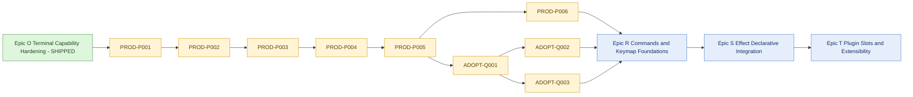

# Engineering Execution Plan

## 0. Version History & Changelog
- v7.6.0 - Activated the first post-Epic-O roadmap wave: Epic P covers the hard-cut Tuvren rename plus packaging and release trust, Epic Q covers adoption and framework positioning, and future framework expansion is staged as commands/keymaps, Effect, and then deferred plugin-slot work.
- v7.5.1 - Marked Epic O shipped after terminal capability state, multiplexer-aware degraded policy, Kitty keyboard disambiguation negotiation, OSC52 write-only clipboard, OSC8 link spans, and host diagnostics landed with native and Bun coverage.
- v7.5.0 - Framed Epic O as the next work-ready wave, sequenced terminal capability hardening behind a protocol/multiplexer spike, and moved completed Epic N work into archived continuity.
- v7.4.1 - Marked Epic N complete after the final authority-cut and coalescing audit: substrate-backed text/textarea/transcript paths are shipped, the benchmark gate is live, and the ticket table now reflects completion instead of in-flight target state.
- ... [Older history truncated, refer to git logs]

## 1. Executive Summary & Active Critical Path
- **Total Active Story Points:** 41
- **Critical Path:** `PROD-P001 -> PROD-P002 -> PROD-P003 -> PROD-P004 -> PROD-P005`, followed by three required closeout tracks: `PROD-P006`, `ADOPT-Q001 -> ADOPT-Q002`, and `ADOPT-Q001 -> ADOPT-Q003`. The active wave is complete only when all three closeout tracks land.
- **Planning Assumptions:**
  - Epic M, Epic N, and Epic O are shipped; the current Brownfield source already includes the native text substrate, transcript and split-pane semantics, devtools, and terminal-capability hardening.
  - The product story is now **general-purpose framework first**, while agentic and transcript-heavy products remain the flagship showcase and the harshest proof workload.
  - Bun remains the only supported runtime in the active contract. Node portability is deferred.
  - The next active wave is productization plus adoption: hard-cut rename to `Tuvren`, one public package over auxiliary scoped native packages, install and release trust, and public positioning refresh.
  - The following framework waves are intentionally sequenced behind that: the remaining planned `v3` foundation wave is commands and keymaps, `v4` then begins with `Effect`, and plugin-slot extensibility only follows after `v1.0` and after both contracts stabilize.
  - React and Solid parity are not roadmap goals in this planning wave.

## 2. Project Phasing & Iteration Strategy
### Current Active Scope
#### Epic P — Tuvren Identity, Packaging, and Release Migration
- Execute the hard public rename from Kraken to Tuvren across package names, host facade names, native artifact naming, diagnostics, release workflow outputs, and the repository and package ownership move into the new organization.
- Replace the current staged-prebuild public install story with one public package backed by auxiliary scoped native packages under the new organization.
- Raise release trust by tightening resolver behavior, smoke verification, and migration diagnostics around the new naming and packaging contract.

#### Epic Q — Adoption and Framework Positioning
- Rewrite onboarding and public messaging so the product reads as a general-purpose terminal framework rather than as a narrow specialist library.
- Preserve agentic and transcript-heavy applications as the flagship showcase and proving ground rather than the sole public story.
- Publish clear pre-`1.0` migration guidance for the hard-cut rename and the new install contract.

### Future / Deferred Scope
#### Epic R — Commands & Keymap Foundations
- Define and implement the first framework-level host services over the existing imperative core and native event stream.
- Establish command registration, dispatch, and keybinding resolution without introducing host-owned UI state or a plugin contract yet.

#### Epic S — Effect Declarative Integration
- Turn the current `effect` stub into the sanctioned declarative path over the same Bun and FFI core.
- Keep the imperative package canonical while offering a clear higher-level integration model for teams that want structured effects and composition after the command and keymap foundations are in place.

#### Epic T — Plugin Slots and Extensibility
- Explore plugin-slot boundaries only after `v1.0` and after commands, keymaps, and the `Effect` posture are stable enough to extend without locking in the wrong host/service contract.

#### Standing Deferrals Preserved
- No Node runtime portability in the active wave.
- No React or Solid parity work; the declarative strategy is `Effect`, not framework-adapter breadth.
- No plugin-slot contract before `v1.0` or before commands/keymaps and `Effect` have proven their boundaries.
- No generic widget-breadth wave as a substitute for productization and framework ergonomics.
- No default background-render promotion while synchronous semantics remain the canonical contract.
- No clipboard read support, Kitty graphics, sixel, inline image protocols, or advanced MIME clipboard work in the active wave.

### Archived or Already Completed Scope
- Epic O (Terminal Capability Hardening) delivered `CORE-O0` through `CORE-O7`: protocol and multiplexer spike, capability state and query APIs, degraded multiplexer policy, Kitty keyboard disambiguation, write-only OSC52 clipboard writes, OSC8 hyperlink emission, runtime color and pixel reporting, and coverage/docs closeout.
- Epic N (Substrate Surface Rebase) delivered `CORE-N0` through `CORE-N7`: contract sync, dirty-range expansion, substrate-backed text rendering, native `EditBuffer`, `TextArea` rebase, the substrate benchmark gate, transcript substrate migration, and post-substrate coverage/posture updates.
- Epic M (Native Text Substrate) delivered `CORE-M0` through `CORE-M4`: the substrate contract memo, native `TextBuffer`, native `TextView`, the unified text renderer, and the §5.4.1 Unicode/wrapping native gate suite.
- The v7 docs-maintenance wave delivered `DOCS-A001` through `DOCS-A003`: canonical artifact normalization, preservation review, and source-truth reconciliation.
- Epics I-L delivered native transcript state, anchor-based viewport behavior, nested scroll handoff, devtools APIs, host inspector surfaces, split-pane layout, transcript-backed composites, and flagship examples.

## 3. Build Order (Mermaid)


## 4. Ticket List

### Epic P — Tuvren Identity, Packaging, and Release Migration (PROD)

**PROD-P001 Inventory the Tuvren Hard-Cut Contract**
- **Type:** Spike
- **Effort:** 3
- **Dependencies:** Epic O shipped
- **Capability / Contract Mapping:** [PRD](./PRD.md) §1.3, [Architecture](./Architecture.md) §1.4 and Risk 9, [TechSpec](./TechSpec.md) ADR-T42, ADR-T43, §1.4, §4.3
- **Description:** Produce a migration inventory that enumerates every public-facing Kraken-era name and release/distribution touchpoint: npm package names, host facade and error types, resolver environment variables, native crate/library names, release asset names, install diagnostics, and CI/release workflow assumptions. If the inventory surfaces contradictions with the approved Tuvren contract, resolve the upstream doc conflict before implementation tickets begin.
- **Acceptance Criteria (Gherkin):**
```gherkin
Given the approved hard-cut move from Kraken to Tuvren
When the repo's public naming, packaging, and release touchpoints are inventoried
Then the inventory records every source, workflow, and user-facing contract that must change
And any contradiction with PRD, Architecture, or TechSpec is resolved upstream before PROD-P002 starts
```

**PROD-P002 Rename the Public Package and Host Facade**
- **Type:** Feature
- **Effort:** 5
- **Dependencies:** PROD-P001
- **Capability / Contract Mapping:** [PRD](./PRD.md) §1.3 and §4.10, [Architecture](./Architecture.md) §1.4, [TechSpec](./TechSpec.md) ADR-T42, §1.2, §4.2
- **Description:** Rename the public TypeScript package contract from `kraken-tui` to `tuvren-tui`, rename the primary host facade from `Kraken` to `Tuvren`, rename the exported host error type and any remaining Kraken-prefixed public TypeScript symbols as part of the same hard cut, and update public imports and package metadata accordingly. Preserve the existing imperative lifecycle model and thin-wrapper rule while changing naming only.
- **Acceptance Criteria (Gherkin):**
```gherkin
Given the host package and public facade still use Kraken-era naming
When the rename wave lands
Then the public package contract is tuvren-tui
And the primary host facade and exported error type use Tuvren naming
And no exported public TypeScript identifier retains Kraken-prefixed branding after the hard cut
And the imperative lifecycle surface remains shape-compatible apart from the approved hard-cut rename
```

**PROD-P003 Rename Native Artifact, Resolver, and Release Contracts**
- **Type:** Feature
- **Effort:** 8
- **Dependencies:** PROD-P002
- **Capability / Contract Mapping:** [PRD](./PRD.md) §1.3 and §5, [Architecture](./Architecture.md) §1.3, §1.4, and Risk 9, [TechSpec](./TechSpec.md) ADR-T42, §1.3, §1.4, §4.3
- **Description:** Rename the native crate and shared-library identities to `tuvren_tui`, apply platform-correct shared-library names (`libtuvren_tui.*` on Unix-like systems and `tuvren_tui.dll` on Windows), replace `KRAKEN_LIB_PATH` with `TUVREN_LIB_PATH`, rename release assets to `tuvren-tui-*`, and update resolver diagnostics and install/load tests to reflect the hard cut. Preserve the `tui_*` ABI prefix.
- **Acceptance Criteria (Gherkin):**
```gherkin
Given the Brownfield native distribution contract still uses Kraken-era names
When the native rename work is complete
Then the crate, shared libraries, environment override, and release assets all use Tuvren naming
And the tui_* ABI prefix remains unchanged
And diagnostics and tests describe only the new contract rather than a long-lived compatibility alias
```

**PROD-P004 Add Auxiliary Scoped Native Package Distribution**
- **Type:** Feature
- **Effort:** 5
- **Dependencies:** PROD-P003
- **Capability / Contract Mapping:** [PRD](./PRD.md) §4.10 and §5, [Architecture](./Architecture.md) §1.3, §1.4, §2.2, and Risk 9, [TechSpec](./TechSpec.md) ADR-T43, §1.3, §1.4, §4.3
- **Description:** Introduce auxiliary scoped native packages under the new organization for the supported platform matrix, wire release automation to publish them, make the repository and package ownership move required for Tuvren publishing explicit, and keep `tuvren-tui` as the only documented public install target.
- **Acceptance Criteria (Gherkin):**
```gherkin
Given the approved one-public-package distribution model
When native packaging automation runs for a release
Then each supported platform target produces an auxiliary scoped native package under the Tuvren organization
And the repository and package ownership needed to publish under the Tuvren organization are in place
And the public package remains the only documented install target
And published package metadata is sufficient for the resolver to discover the correct native library automatically
And Epic P records and verifies the Bun-first enforcement strategy that prevents glibc-only artifacts from silently installing on unsupported musl hosts
And the chosen Bun package-manager strategy either proves the supported install path does not silently materialize unrelated platform payloads or records the supported fallback and diagnostic path if Bun's optional-dependency behavior would do so
```

**PROD-P005 Update Resolver and Install UX for the New Package Topology**
- **Type:** Feature
- **Effort:** 5
- **Dependencies:** PROD-P002, PROD-P003, PROD-P004
- **Capability / Contract Mapping:** [Architecture](./Architecture.md) §2.2, [TechSpec](./TechSpec.md) ADR-T43, §4.3, §5.2
- **Description:** Update resolver logic, diagnostics, and install smoke coverage so the public package checks `TUVREN_LIB_PATH` first, then resolves the auxiliary scoped native package for the current platform, and finally preserves local Cargo-build fallback for source checkouts and direct repo verification.
- **Acceptance Criteria (Gherkin):**
```gherkin
Given a published tuvren-tui install on a supported platform
When the resolver loads the native library
Then it searches TUVREN_LIB_PATH first
And otherwise resolves the correct auxiliary scoped native package artifact for the current platform
And source checkouts still fall back to the local Cargo-built artifact when packaged binaries are absent
And ordinary public installs fail with the documented diagnostic instead of source-building when neither the override nor the packaged native artifact is available
```

**PROD-P006 Add Cross-Platform Host Smoke Verification**
- **Type:** Chore
- **Effort:** 3
- **Dependencies:** PROD-P005
- **Capability / Contract Mapping:** [PRD](./PRD.md) §5, [TechSpec](./TechSpec.md) §5.4, [docs/reports/GatePolicy.md](./reports/GatePolicy.md)
- **Description:** Extend CI with macOS and Windows host smoke verification for install, load, and basic host-surface confidence while keeping the benchmark-heavy gates Linux-blocking until cross-platform performance gates are intentionally promoted.
- **Acceptance Criteria (Gherkin):**
```gherkin
Given the active productization wave
When CI runs on Linux, macOS, and Windows
Then macOS and Windows exercise install, load, and core host smoke coverage
And Linux remains the blocking benchmark environment for bundle, FFI, and render-budget enforcement
And GatePolicy documents the new cross-platform trust posture
```

### Epic Q — Adoption and Framework Positioning (ADOPT)

**ADOPT-Q001 Rewrite Public Onboarding Around Tuvren's Framework Story**
- **Type:** Chore
- **Effort:** 5
- **Dependencies:** PROD-P002, PROD-P003, PROD-P005
- **Capability / Contract Mapping:** [PRD](./PRD.md) §1.1, §1.2, §3, §6, [Architecture](./Architecture.md) §1.3 and §1.4
- **Description:** Rewrite the public getting-started and adoption narrative around Tuvren as a general-purpose framework with a productized imperative core, while preserving the repo's architectural invariant that Rust owns mutable UI state. Install instructions, naming, scope framing, README messaging, and developer expectations must match the new packaging contract and runtime posture.
- **Acceptance Criteria (Gherkin):**
```gherkin
Given a new developer discovering the project after the rename
When they read the primary onboarding and install guidance
Then the product is described as a general-purpose terminal framework
And the docs present Bun as the active runtime contract
And the install and naming guidance match the shipped Tuvren package and resolver behavior
And README plus the primary onboarding entrypoints reflect the same framework story and install contract
```

**ADOPT-Q002 Refresh Showcase Framing Without Losing the Agentic Proof Point**
- **Type:** Feature
- **Effort:** 5
- **Dependencies:** ADOPT-Q001
- **Capability / Contract Mapping:** [PRD](./PRD.md) §1.1, §3, §4.10, §4.11, §4.12, [Architecture](./Architecture.md) §1.3, §4.4, §4.5
- **Description:** Refresh flagship examples, showcase copy, and example categorization so the repo clearly reads as a general-purpose framework while still presenting agentic, transcript-heavy, and pane-dense applications as the most demanding proof workload.
- **Acceptance Criteria (Gherkin):**
```gherkin
Given the flagship examples and showcase materials
When the adoption refresh is complete
Then the repo presents a general-purpose framework story rather than a single-use-case library story
And agentic and transcript-heavy applications remain the lead proof examples
And example framing makes clear why those workloads are the harshest demonstration of the architecture
```

**ADOPT-Q003 Publish Hard-Cut Migration Guidance**
- **Type:** Chore
- **Effort:** 2
- **Dependencies:** ADOPT-Q001, PROD-P005
- **Capability / Contract Mapping:** [PRD](./PRD.md) §1.3, [TechSpec](./TechSpec.md) ADR-T42, ADR-T43, §4.2, §4.3
- **Description:** Publish concise migration guidance for pre-`1.0` adopters covering the Kraken-to-Tuvren rename, the new public package name, shared-library and release-asset renames, the `TUVREN_LIB_PATH` override, and the removal of long-lived compatibility aliases.
- **Acceptance Criteria (Gherkin):**
```gherkin
Given an adopter familiar with Kraken-era package and resolver names
When they read the migration guidance
Then they can translate the old package, facade, and environment-variable names to the new Tuvren contract
And the guidance includes a concrete old-to-new mapping for package, facade, shared-library, release-asset, and environment-variable names
And the guidance explicitly states that the rename is a hard pre-1.0 cut rather than an alias-supported transition
```

## 5. Ticket Summary Table

### 5.1 Active Epic P and Q Summary

| ID | Epic | Type | SP | Dependencies | Phase |
| --- | --- | --- | --- | --- | --- |
| PROD-P001 | P | Spike | 3 | Epic O shipped | Active |
| PROD-P002 | P | Feature | 5 | PROD-P001 | Active |
| PROD-P003 | P | Feature | 8 | PROD-P002 | Active |
| PROD-P004 | P | Feature | 5 | PROD-P003 | Active |
| PROD-P005 | P | Feature | 5 | PROD-P002, PROD-P003, PROD-P004 | Active |
| PROD-P006 | P | Chore | 3 | PROD-P005 | Active |
| ADOPT-Q001 | Q | Chore | 5 | PROD-P002, PROD-P003, PROD-P005 | Active |
| ADOPT-Q002 | Q | Feature | 5 | ADOPT-Q001 | Active |
| ADOPT-Q003 | Q | Chore | 2 | ADOPT-Q001, PROD-P005 | Active |
|  |  | **TOTAL** | **41** |  |  |

### 5.2 Archived Epic O Summary

| ID | Epic | Type | SP | Dependencies | Phase |
| --- | --- | --- | --- | --- | --- |
| CORE-O0 | O | Spike | 3 | Epic N shipped | Done |
| CORE-O1 | O | Feature | 5 | CORE-O0 | Done |
| CORE-O2 | O | Feature | 5 | CORE-O1 | Done |
| CORE-O3 | O | Feature | 8 | CORE-O2 | Done |
| CORE-O4 | O | Feature | 3 | CORE-O2 | Done |
| CORE-O5 | O | Feature | 5 | CORE-O1, CORE-O2 | Done |
| CORE-O6 | O | Feature | 5 | CORE-O2 | Done |
| CORE-O7 | O | Chore | 3 | CORE-O3, CORE-O4, CORE-O5, CORE-O6 | Done |
|  |  | **TOTAL** | **37** |  |  |

### 5.3 Archived Epic N Summary

| ID | Epic | Type | SP | Dependencies | Phase |
| --- | --- | --- | --- | --- | --- |
| CORE-N0 | N | Chore | 2 | Substrate (Epic M, shipped) | Done |
| CORE-N1 | N | Feature | 3 | N0 | Done |
| CORE-N2 | N | Feature | 5 | N1 | Done |
| CORE-N3 | N | Feature | 5 | N1 | Done |
| CORE-N4 | N | Feature | 8 | N3 | Done |
| CORE-N5 | N | Chore | 5 | N1 | Done |
| CORE-N6 | N | Feature | 8 | N1, N2, N5 | Done |
| CORE-N7 | N | Chore | 2 | N2, N4, N6 | Done |
|  |  | **TOTAL** | **38** |  |  |

### 5.4 Archived Epic M Summary

| ID | Epic | Type | SP | Dependencies | Phase |
| --- | --- | --- | --- | --- | --- |
| CORE-M0 | M | Spike | 2 | None | Done |
| CORE-M1 | M | Feature | 8 | M0 | Done |
| CORE-M2 | M | Feature | 8 | M1 | Done |
| CORE-M3 | M | Feature | 5 | M2 | Done |
| CORE-M4 | M | Chore | 5 | M3 | Done |
|  |  | **TOTAL** | **28** |  |  |

## 6. Archived Continuity Summary

### 6.1 Archived v7 Docs-Maintenance Wave

| ID | Type | SP | Status | Outcome |
| --- | --- | --- | --- | --- |
| DOCS-A001 | Chore | 3 | Done | Rewrote the canonical docs chain into the current framework skeleton. |
| DOCS-A002 | Chore | 2 | Done | Verified preservation of glossary, scope, delivered capabilities, and continuity notes. |
| DOCS-A003 | Chore | 3 | Done | Reconciled the rewritten docs against source, tests, examples, and workflows. |
|  |  | **8** |  |  |

### 6.2 Archived v6 Delivery Wave
- **Total Archived Story Points:** 85
- **Archived Critical Path:** `TASK-I0 -> TASK-I1 -> TASK-I2 -> TASK-I3 -> TASK-I4 -> TASK-I5 -> TASK-J0 -> TASK-J1 -> TASK-J2 -> TASK-J3 -> TASK-J4 -> TASK-L1 -> TASK-L3`
- **Delivered outcomes preserved for continuity:** native transcript and anchor semantics, replay and benchmark gates, devtools APIs and inspector surfaces, native split-pane behavior, host composites (`CommandPalette`, `TracePanel`, `StructuredLogView`, `CodeView`, `DiffView`), and flagship examples (`agent-console`, `ops-log-console`, `repo-inspector`).
